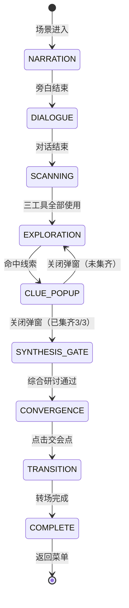

# 序章 · 残页 —— 探索寻线玩法设计文档

> **文档性质**: 玩法设计详案（非代码文档）
> **版本**: v3.0
> **最后更新**: 2026-06-09

---

## 一、设计总纲

### 1.1 核心体验目标

玩家扮演古画修复研究生沈念，在高精度扫描仪前独立完成对《拙政园三十一景图》第三十一景的首次检查。序章的玩法目标是让玩家亲手体验**"从表面完整中发现隐藏痕迹"**的过程——这同时也是整部游戏核心悬念的隐喻。

### 1.2 设计原则

| 原则 | 说明 |
|------|------|
| **主动发现** | 线索不主动暴露自己，玩家必须动手寻找，而非被动接收 |
| **渐进引导** | 不设硬失败，错误操作只会触发越来越明确的引导提示 |
| **叙事融入** | 所有 UI 反馈均以叙事语言呈现，不出现游戏机制术语 |
| **节奏可控** | 玩家可以选择在每条线索上花更多时间（询问周老师、记笔记），也可以快速推进 |

### 1.3 序章完整节拍表

```
┌───────────────────────────────────────────────────────────┐
│  序章 · 残页                                               │
│                                                           │
│  ① 场景旁白（3段） ─→ ② 导师出场旁白                        │
│  ─→ ③ 周鹤年对话（5段气泡）                                 │
│  ─→ ④ 工具扫描阶段（三工具逐一使用）                         │
│  ─→ ⑤ 自由探索阶段（放大镜缩放 + 点击寻线）                  │
│  ─→ ⑥ 线索弹窗（发现线索 + 询问/记录）× 3                   │
│  ─→ ⑥-b 综合研讨门槛（三线索集齐 → 强制AI推理通过）          │
│  ─→ ⑦ 汇聚确认（交会点出现 + 玩家主动点击）                  │
│  ─→ ⑧ 跌入画中转场（褪色→墨迹→文字→回声→淡出）              │
│  ─→ ⑨ 返回菜单 · 解锁第一章                                │
│                                                           │
└───────────────────────────────────────────────────────────┘
```

---

## 二、阶段详设

### 阶段 ④：工具扫描

> **入口条件**：周鹤年 5 段对话结束
> **退出条件**：三种工具各使用至少一次

#### 画面布局

```
┌──────────────────────────── 100% ────────────────────────────┐
│                                                               │
│                                              ┌──────────┐    │
│                                              │📓 修复笔记本│    │
│          第三十一景 · 全屏展示                 │[对话|记录] │    │
│        （带工具特效叠加层）                    │[对话历史]  │    │
│                                              │[快捷按钮]  │    │
│                                              │[输入框]    │    │
│                                              ├──────────┤    │
│                                              │🔍 🔬 💡   │    │
│                                              │已使用: 0/3│    │
│                                              └──────────┘    │
├──────────────────────────────────────────┐  ┌───┐            │
│  "装裱接缝处有重叠痕迹。"                 │  │📓│            │
│                                          │  │📦│            │
└──────────────────────────────────────────┘  └───┘            │
└──────────────────────────────────────────────────────────────┘
```

> [!NOTE]
> 工具按钮位于笔记本面板底部工具区，非独立工具栏。古画全屏展示，沉浸感更强。

#### 交互逻辑

| 操作 | 响应 |
|------|------|
| 点击笔记本面板底部工具按钮 | 切换到该工具的视觉特效（仅 filter 滤镜，无画面缩放位移） |
| 首次使用某工具 | 画面中央 pv-feedback 浮现检测结果文本（4.5s 后自动消失），工具按钮标记 ✓，检测结果同步记入笔记本记录Tab |
| 已使用工具再次点击 | 不响应（已标记 ✓ 的按钮不可重复触发） |
| 三工具全部使用 | 工具区全部按钮锁定灰掉；画面自动切换为放大镜模式；延迟提示"三项检查完成，已切换到放大镜。在画面中点击寻找异常。"→ 进入阶段 ⑤ |

#### 三工具反馈文本

| 工具 | 视觉效果 | 反馈文本（pv-feedback） |
|------|---------|---------|
| 🔍 放大镜 | contrast(1.1) + brightness(1.05) | "放大镜已就位。装裱接缝处有重叠痕迹，边框似乎压住了旧题签的一角。" |
| 🔬 纸质分析 | contrast(1.3) + saturate(0.3) + brightness(1.1) | "纸质分析完成。背纸与其他三十页不完全一致，此页曾经重装；画心本身较稳定。" |
| 💡 侧光照射 | contrast(1.15) + brightness(0.95) | "侧光照射完成。装裱边下方隐约显出旧字残痕和一条极淡的低位辅助线。" |

#### 三工具全部使用后的过渡

1. 工具区所有按钮锁定灰掉（`.locked`），不可再点击
2. 画面自动切换到放大镜模式（applyTool('magnifier')）
3. 派发 `all-tools-used` 事件
4. 延迟 3s 后 pv-feedback 提示："三项检查完成，已切换到放大镜。在画面中点击寻找异常。"
5. 底部状态栏显示 `线索 ○○○ 0/3 已发现`

---

### 阶段 ⑤：自由探索

> **入口条件**：阶段 ④ 过渡完成
> **退出条件**：找到全部 3 处线索

#### 画面布局

```
┌─────────────────────────────────────────────┐
│                                             │
│                                             │
│                                             │
│        第三十一景 · 可缩放 / 可拖拽           │  ← 鼠标变为放大镜图标
│       （无工具特效，原画高清展示）             │
│                                             │
│                                             │
│                                             │
├──────────────────────────────────┐  ┌───┐  │
│  🔍 线索: 0 / 3                  │  │📓│  │  ← 底部对话框 + HUD
│                                  │  │📦│  │
└──────────────────────────────────┘  └───┘  │
└─────────────────────────────────────────────┘
  右侧笔记本面板强制展开（悬浮 ~240px）
```

#### 缩放与平移

| 操作 | 行为 | 参数 |
|------|------|------|
| **鼠标滚轮上滑** | 以鼠标位置为中心放大画面 | 每次 +0.25×，最大 3.5× |
| **鼠标滚轮下滑** | 以鼠标位置为中心缩小画面 | 每次 -0.25×，最小 1.0× |
| **鼠标左键按住拖拽** | 平移画面（仅缩放 > 1.0× 时有效） | 实时跟随，松开惯性滑动 |
| **双击画面** | 若当前 1.0× → 快速放大到 2.0×；若已放大 → 还原到 1.0× | 带 0.3s 缓动动画 |

**边界约束**：
- 画面任何一边不得拖出可视区域（始终有画面内容填满窗口）
- 缩放时如果画面边缘超出，自动回弹校正

**鼠标光标**：
- 默认状态：`🔍` 放大镜图标（CSS `cursor: zoom-in`）
- 拖拽中：`✋` 抓手图标（CSS `cursor: grabbing`）
- 悬停在已发现线索标记上：`👆` 指针（CSS `cursor: pointer`）

#### 点击探寻

玩家在画面上**单击**试图寻找线索。系统判定点击位置是否落在某个线索的判定区内。

**判定机制**：
- 每个线索有一个**圆形判定区**，定义为 `{ cx, cy, radius }`（百分比坐标，相对于原画尺寸）
- 玩家点击时，将屏幕坐标反算为原画百分比坐标（考虑当前缩放和平移偏移）
- 若距离某个未发现线索的中心 ≤ `radius`，则判定为"命中"
- 若未命中任何线索，则 `wrongClickCount++`

**命中反馈**：
- 画面在命中位置播放一个短暂的**金色涟漪扩散**动画（0.5s）
- 同时画面自动缓缓缩放到该区域（如果玩家当前缩放比例较小）
- 0.5s 后弹出线索窗口（阶段 ⑥）

**未命中反馈**：
- 点击位置出现一个极淡的**灰色涟漪**（0.3s 消失），表示"这里没有发现"
- 不弹出任何文字，保持沉浸感
- 后台 `wrongClickCount` 静默累加

#### 已发现线索的标记

当某处线索被发现并关闭弹窗后，该位置留下一个**常驻视觉标记**：
- 微弱的金色圆形光点（半径约 20px）
- 低频慢呼吸动画（`opacity: 0.4 ↔ 0.7`，周期 3s）
- 悬停时显示线索名称 tooltip（如"装裱接缝残角"）
- 点击可重新查看线索内容（但按钮变为"已记录 ✓"）

#### 探索进度显示

线索进度显示在笔记本面板的"记录"tab 中：

- `●` = 已发现（金色实心圆）
- `○` = 未发现（灰色空心圆）
- 发现线索后笔记本面板 📓 按钮呼吸灯高亮提示

---

### 阶段 ⑤-b：渐进提示（错误引导）

> **触发条件**：`wrongClickCount` 达到阈值
> **设计理念**：每累计 3 次错误多给一条位置光斑，文案按具体未找到的线索方位差异化

#### 提示机制

- 每累计 3 次错误点击，显示一条新的呼吸光斑（最多显示到所有未找到线索都有光斑为止）
- 光斑按线索定义顺序依次显示（clue_margin → clue_text → clue_line）
- 文案根据当前新显示的线索给出方位引导

#### 提示文案

| 触发条件 | 新增光斑 | pv-feedback 文案 |
|---------|---------|---------|
| 错误 ≥ 3 次 | 第 1 条未找到线索 | 根据具体线索（见下表） |
| 错误 ≥ 6 次 | 第 2 条未找到线索 | 根据具体线索 |
| 错误 ≥ 9 次 | 第 3 条未找到线索 | 根据具体线索 |

**各线索方位提示**：

| 线索 | 提示文案 |
|------|---------|
| clue_margin | "💡 注意观察画面右上方的装裱边缘……" |
| clue_text | "💡 试试画面左下方，装裱层底下似乎有字迹……" |
| clue_line | "💡 画面下方中部有一条不属于画面内容的痕迹……" |

#### 光斑视觉

- 圆形呼吸光斑（90px），金色渐变
- 动画：scale(0.8)↔scale(1.2)，opacity 0.4↔0.9，周期 1.8s
- 玩家找到对应线索后该光斑自动移除

---

### 阶段 ⑥：线索发现与辅助讨论

> **入口条件**：玩家点击命中某处线索
> **退出条件**：线索自动确认，辅助讨论可选

#### 命中后流程

1. 命中位置播放**金色涟漪**动画（1s）
2. pv-feedback 提示 `📌 发现线索「线索名」，已记入笔记本`（4.5s 消失）
3. 线索自动确认并记入笔记本记录 Tab
4. 笔记本面板启动该线索的辅助讨论（周老师批注浮现）
5. 玩家可自由与 AI 讨论该线索，不阻塞探索进度
6. 错误计数重置为 0

#### 辅助讨论

- 周鹤年的回复以"批注"形式出现在笔记本对话区
- AI 身份为"修复笔记本中预置的批注"，非实时对话
- 玩家可选择继续讨论或直接回去找下一条线索
- 讨论不影响通关进度，纯粹加深理解

> [!NOTE]
> 不使用线索弹窗。发现即确认的设计降低了操作负担，同时通过辅助讨论保留了深度理解的空间。

#### 三处线索详设

**线索 1：装裱接缝残角**

| 属性 | 值 |
|------|------|
| 判定区中心 | 画面右上 `(85%, 12%)` |
| 判定半径 | 8%（原画尺寸百分比） |
| 叙事定位 | 指向"有人刻意裁去了旧题签" → 证据：来源说明被物理移除 |
| 弹窗标题 | 装裱接缝残角 |
| 弹窗内容 | "装裱边缘压住了一小片旧题签的残角。题签纸质与画心不同，边缘有被刀裁切过的痕迹——有人在重新装裱时，把原来的题签裁掉了大部分，只留下了被新边覆盖的这一角。" |
| 周鹤年预填消息 | "我在装裱接缝处发现了一小片被裁掉的旧题签残角，这说明什么？" |
| 存入记事簿文案 | `[线索] 装裱接缝残角 — 旧题签被刻意裁去，只留被覆盖的一角` |

**线索 2："……所见"残字**

| 属性 | 值 |
|------|------|
| 判定区中心 | 画面左下 `(14%, 80%)` |
| 判定半径 | 8% |
| 叙事定位 | 指向"有人曾在此标注视角来源" → 核心证据 |
| 弹窗标题 | "……所见"残字 |
| 弹窗内容 | "侧光下，装裱边的下方隐约浮现两个残字：'……所见'。笔迹纤细，不像是文徵明的书风。倒更像是某种旁注——有人曾在这里标注过什么，后来被装裱层压在了下面。" |
| 周鹤年预填消息 | "装裱层下有两个残字'所见'，笔迹不像文徵明，这是谁写的？" |
| 存入记事簿文案 | `[线索] "……所见"残字 — 装裱层下的陌生笔迹旁注` |

**线索 3：底层细线**

| 属性 | 值 |
|------|------|
| 判定区中心 | 画面中下 `(50%, 75%)` |
| 判定半径 | 10%（较大，因为细线是横向的） |
| 叙事定位 | 指向"画面下方有不属于画面内容的痕迹" → 异常但含义未明 |
| 弹窗标题 | 底层细线 |
| 弹窗内容 | "一条极淡的线横贯画面下方，比裂纹规整，但不是画面内容的一部分，也不像装裱时留下的。它在那里很久了，但没有人在正式记录中提到过它。" |
| 周鹤年预填消息 | "画面下方有一条极淡的线，不像裂纹也不像装裱的一部分，这可能是什么？" |
| 存入记事簿文案 | `[线索] 底层细线 — 画面下方有一条不属于画面内容的极淡细线` |

---

### 阶段 ⑦：汇聚确认

> **入口条件**：3 处线索全部发现并关闭弹窗
> **退出条件**：玩家点击交会点

#### 流程

```
3/3 线索收集完成
    │
    ▼
画面自动缓缓还原到 1.0× 缩放（0.8s 缓动）
    │
    ▼
旁白面板浮现（需点击推进）：
"三处痕迹都藏在装裱层下面。不是破损，不是修补——
 倒像是有什么东西被刻意压在了下面。"
     │
     ▼
点击推进 → 旁白切换：
"残字、细线、被裁去的题签……
 它们的交会处，就在这里。"
    │
    ▼
画面上，三处已发现的金色标记同时发出一道细线，
三线汇聚到画面中央偏下方的一个点——交会点
    │
    ▼
交会点出现：金色光圈 + 脉冲动画
（比探索阶段的标记更强烈、更明亮）
交会点下方浮现文字提示："点击查看"
    │
    ▼
玩家点击交会点
    │
    ▼
触发阶段 ⑧：跌入画中转场
```

#### 交会点视觉设计

```
        ╭─ 来自线索1的细线（右上→中下）
        │
   ●────●────● ← 交会点（金色脉冲光圈，60×60px）
   │         │
   │         ╰─ 来自线索3的细线（中下横线方向）
   │
   ╰─ 来自线索2的细线（左下→中下）
```

- 三条连接线：`1px` 金色半透明线，从各标记点向交会点连线
- 连接线动画：从各标记点向交会点**依次生长**（各 0.6s，间隔 0.3s）
- 交会点：出现时从 `scale(0)` 弹到 `scale(1)` + 金色脉冲呼吸
- 交会点下方文字"点击查看"：淡入显示，小字号，金色

#### 触发跌入

玩家点击交会点后：

1. 交会点爆发一圈金色涟漪
2. 短暂停顿（0.3s）
3. 记录状态变量 `foundMarginTrace = true`
4. 进入跌入画中转场（阶段 ⑧，沿用现有 `FallTransition`）

> 注：修复笔记本已在阶段③→④过渡时获得（周鹤年对话结束后），此处不再重复给予。

---

## 三、状态机总览



### 阶段 ⑥-b：综合研讨门槛（三线索集齐后）

> **入口条件**：3 处线索全部发现，玩家主动点击"进入综合研讨"按钮
> **退出条件**：玩家通过前端关键词匹配表达出核心认知
> **详细配置**：见 `Web/src/core/gate-config.js`

**流程**：
1. 三线索集齐后，第三条线索的辅助讨论正常启动（周老师批注浮现）
2. 延迟 8s 后画面下方（pv-feedback 位置）出现按钮"进入综合研讨：分析三处痕迹的关系"
3. 玩家可先在笔记本中与 AI 讨论第三条线索，准备好后点击按钮
4. 点击后：
   - 笔记本工具区隐藏
   - 对话 Tab 标签改名为"综合研讨"，关闭按钮隐藏，面板锁定不可收起
   - 聊天区域清空，左侧边框变金色强调
   - 画面下方显示持久提示"综合研讨 — 在笔记本中分析三处痕迹之间的关系"
   - 记录 Tab 保持可切换（玩家可随时查阅之前的线索记录）
5. 玩家自由输入推断，AI 以"预置批注浮现"身份引导深入
6. 前端关键词累积匹配判定：`(systematic OR intentional_act) AND (conceal_origin OR erase_evidence)`，且轮数 >= 2
7. 通过后：结论摘要记入笔记本记录 Tab → 面板恢复正常态 → 持久提示隐藏 → 进入汇聚阶段

**AI 身份**：修复笔记本中周鹤年预先留下的批注（非实时对话），禁止任何指涉当下交互的表述

**核心认知目标**：玩家需表达"有人系统性地遮蔽了这幅画的来源信息"

**离线降级**：
- 快捷按钮预设为可直接通过的答案文本
- hintPool 三条引导逐步缩小答案范围
- 连续 5 轮未通过 → 刷新为更直白的快捷按钮

### 状态变量追踪

| 变量 | 类型 | 写入时机 | 用途 |
|------|------|---------|------|
| `scanToolsUsed` | int (0-3) | 每使用一个工具 +1 | 判断是否进入探索阶段 |
| `cluesFound` | string[] | 每发现一处线索时 push ID | 判断线索收集进度 |
| `wrongClickCount` | int | 每次未命中 +1 | 触发渐进提示 |
| `hasNotebook` | bool | 周鹤年对话结束后（阶段③→④过渡） | 解锁笔记本 UI |
| `synthesisPassed` | bool | 综合门槛通过时 | 标记是否已通过综合研讨 |
| `foundMarginTrace` | bool | 点击交会点时 | 终章结局分支条件 |

> [!IMPORTANT]
> `cluesFound` 和 `wrongClickCount` 仅为运行时变量，不需要写入 `gameProgress` 存档（序章不支持中途存档恢复到探索阶段）。`hasNotebook`、`synthesisPassed`、`foundMarginTrace`、`scanToolsUsed` 需要持久化到 `gameProgress`。

---

## 四、边界情况与容错

| 场景 | 处理方式 |
|------|---------|
| 玩家在探索阶段按 Esc | 弹出确认："离开后当前探索进度不会保存，确定返回菜单？" |
| 玩家在线索弹窗打开时按 Esc | 关闭弹窗（前提：至少执行了一项操作）；若未执行任何操作则不响应 Esc |
| 玩家询问周老师后关闭对话面板 | 线索弹窗恢复显示，"询问周老师"按钮变为"✓ 已询问" |
| 玩家在探索阶段通过笔记本面板询问 | 正常对话（不影响探索状态）；关闭或收缩面板后继续探索 |
| 玩家重复点击已发现的线索位置 | 重新打开线索弹窗（只读模式：按钮均为"已记录 ✓"状态） |
| AI 服务不可用时点击"询问周老师" | 按钮可点击，对话面板打开，发送消息后走降级流程（叙事化错误文本） |
| 窗口大小变化 / 全屏切换 | 重新计算缩放和平移的约束边界，确保画面不溢出 |

---

## 五、叙事整合要点

### 与核心逻辑的一致性

> 核心逻辑：第三十一景的画面保留了王蘅发现的低位视角；文徵明以自己的笔保存了她的眼睛。后人并没有重画此景，而是在重装、配边、归档过程中遮蔽了说明这个视角来源的边注、题签、辅助线和残字。

三处线索的设计严格对应核心逻辑中的"被遮蔽的来源说明"：

```
装裱接缝残角  →  题签（来源标注载体）被裁去
"……所见"残字  →  旁注（来源文字记录）被压在装裱层下
低位构图辅助线 →  辅助线（来源视角证据）残留在画面中
```

玩家在序章亲手找到的不是"一幅画的破损"，而是"一段来源信息被系统性地移除的证据"。这为后续章节"找回被吸收掉的观看来源"埋下了悬念基础。

### 周鹤年 AI 对话的叙事约束

当玩家通过线索弹窗的"询问周老师"发送预填消息时，周鹤年 AI 的回复应当：

- ✅ 从修复学角度解释技术细节（纸张分析、装裱工艺等）
- ✅ 引导玩家思考"为什么这些痕迹被遮盖了"
- ❌ 不直接揭示王蘅的存在
- ❌ 不直接说出"视角来源"的答案
- ❌ 不改变三基准中的任何设定

---

## 六、文件变更清单

| 操作 | 文件 | 说明 |
|------|------|------|
| **新建** | `src/components/narration-bar.js` | 叙事对话框（立绘+打字机+旁白态），替代 PrologueDock 脚本播放 |
| **新建** | `src/components/notebook-floating.js` | 悬浮笔记本面板（AI 对话+记录+工具区），替代 PrologueDock 研讨和旧 notebook-panel |
| **新建** | `src/components/hud-bar.js` | 右下角 HUD 按钮栏（📓📦） |
| **新建** | `src/components/inventory-popup.js` | 物件匣弹出浮层 |
| **修改** | `src/components/painting-viewer.js` | 移除内置工具栏 UI；新增 `onAllCluesRecorded` 回调和 `triggerConvergence()` 方法 |
| **修改** | `src/pages/prologue.js` | 引入新组件替代 PrologueDock；新增 SYNTHESIS_GATE 阶段；接入综合门槛 |
| **修改** | `src/core/gate-config.js` | 新增 `gate_prologue_synthesis` 配置和累积匹配函数 |
| **修改** | `src/core/discussion-gate.js` | 新增 `startSynthesisGate` / `handleSynthesisInput` 方法 |
| **修改** | `src/styles/index.css` | 新增探索模式、线索弹窗、汇聚连线等样式 |
| **废弃** | `src/components/prologue-dock.js` | 由 narration-bar + notebook-floating 替代 |
| **废弃** | `src/components/scanner-ui.js` | 工具 UI 迁移至 notebook-floating 工具区 |
| **废弃** | `src/components/chat-panel.js` | 由 notebook-floating 替代 |
| **废弃** | `src/components/clue-explorer.js` | 已由 painting-viewer 替代 |
| **废弃** | `src/components/clue-popup.js` | 已由 painting-viewer 替代 |
