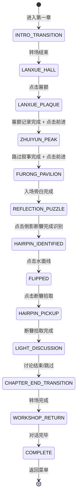

# 第一章 · 东园 —— 画中探索玩法设计文档

> **文档性质**: 玩法设计详案（非代码文档）
> **版本**: v1.0
> **最后更新**: 2026-06-09

---

## 一、设计总纲

### 1.1 核心体验目标

玩家首次进入画中世界，在东园（兰雪堂至芙蓉榭）中完成从"观察者"到"参与者"的转变。第一章的玩法目标是让玩家亲身体验**"画中世界不是现实园林的复制品，而是图像、记忆和修复行为共同生成的空间"**——并在芙蓉榭的水面倒影中发现第一个与王蘅直接相关的物证。

### 1.2 设计原则

| 原则 | 说明 |
|------|------|
| **沉浸建立** | 第一章是玩家首次进入画中世界，需通过视觉、文案和交互逐步建立"身在画中"的感受 |
| **教学融入** | 匾额异常识别作为本章方法锚点，通过叙事自然引出，不设独立教程 |
| **主动发现** | 核心谜题（倒影取簪）要求玩家主动操作，非被动观看 |
| **渐进引导** | 不设硬失败，错误操作触发提示升级，允许重新尝试 |
| **铺垫优先** | 匾额多余笔画与缀云峰低处提示在本章仅作埋线，不要求玩家即时理解 |

### 1.3 第一章完整节拍表

```
┌───────────────────────────────────────────────────────────┐
│  第一章 · 东园                                             │
│                                                           │
│  ① 章节入场转场（引言动画，可跳过）                             │
│  ─→ ② 兰雪堂 · 初识画中世界（环境观察 + 匾额异常）          │
│  ─→ ③ 缀云峰 · 路过触发（环境叙事 + 可选蹲下互动）          │
│  ─→ ④ 芙蓉榭 · 水面倒影谜题（观察→点击→翻转→拾取断簪）     │
│  ─→ ⑤ 轻量讨论（笔记本中 AI 引导讨论"蘅"字含义）           │
│  ─→ ⑥ 章末画面褪色转场                                     │
│  ─→ ⑦ 返回现实 · 工作室（周鹤年对话 + 方法讲解）             │
│  ─→ ⑧ 章节结束 · 解锁第二章                                │
│                                                           │
└───────────────────────────────────────────────────────────┘
```

---

## 二、阶段详设

### 阶段 ①：章节入场转场

> **入口条件**：序章跌入转场完成 / 从菜单选择"继续"进入
> **退出条件**：转场动画结束（自动/玩家按键跳过）

- 全屏转场引言动画（复用 `intro-transition-overlay` 样式）
- 背景为浅黄宣纸纹理，与序章一致
- 标题「第一章 · 东园」居中显示
- 副标题「兰雪堂至芙蓉榭」
- 下方文字逐行浮现，玩家可按空格/Z键跳过
- 文字全部显示后自动淡出（1s），切换到兰雪堂场景

---

### 阶段 ②：兰雪堂 · 初识画中世界

> **入口条件**：入场转场结束
> **退出条件**：匾额异常自动记录 + 玩家点击前进

#### 画面布局

```
┌──────────────────────────── 100% ────────────────────────────┐
│                                                               │
│                                              ┌──────────┐    │
│                                              │📓 修复笔记本│    │
│         兰雪堂场景 · 全屏展示                  │[对话|记录] │    │
│     （青石板路 + 翠竹 + 敞厅 + 匾额）          │[对话历史]  │    │
│                                              │[快捷按钮]  │    │
│                                              │[输入框]    │    │
│                                              └──────────┘    │
│                      【pv-feedback 浮条区】                    │
├──────────────────────────────────────────┐  ┌───┐            │
│  叙事对话框                                │  │📓│            │
│  "你踩了踩脚下的石板。有些温热……"          │  │📦│            │
└──────────────────────────────────────────┘  └───┘            │
└──────────────────────────────────────────────────────────────┘
```

> [!NOTE]
> 第一章无工具区（工具区为序章扫描专用）。快捷按钮仅在轻量讨论阶段可见。pv-feedback 浮条出现在画面中央偏下，4s 后自动消失。

#### 环境交互

玩家可点击场景中的标记元素触发短描述。可点击元素以微弱光点提示。

| 可点击元素 | 点击反馈（pv-feedback 浮现，4s 消失） |
|-----------|--------------------------------------|
| 青石板路 | "脚下的石板有些温热，纹理清晰得像刚刻上去的。" |
| 翠竹 | "竹叶沙沙作响，但你没有感到风。" |
| 廊柱 | "木纹里藏着细密的墨线。它不是一根柱子，它是一笔画出来的。" |
| 匾额 | 触发匾额异常叙事（见下方） |

> [!NOTE]
> 青石、竹影、廊柱为氛围元素，可点可不点，不影响流程推进。匾额为叙事触发点，玩家必须点击匾额才能推进。

#### 匾额异常（叙事触发）

玩家点击匾额后，触发以下叙事序列（在叙事对话框中播放）：

1. 旁白描述匾额外观
2. 沈念内心独白注意到多余笔画
3. 自动记录至笔记本记录 Tab

**记录内容**：`[线索] 匾额多余笔画 — 兰雪堂匾额"兰"字草字头下多了一道极细横笔，笔力稳定，墨色一致，非败笔`

> [!IMPORTANT]
> 匾额多余笔画在第一章仅作为"不理解的异常"记录，不给出解释。玩家此时不知道这道笔画与王蘅有关。真正的情感追认发生在第三章读信之后（节拍5.5）。

#### 前进触发

匾额记录完成后，场景右侧/前方出现方向指示（如石径延伸 + 淡金色箭头提示），文案：

> "前方石径蜿蜒，隐约可见一块嶙峋巨石。"

玩家点击方向指示 → 转场至缀云峰。

---

### 阶段 ③：缀云峰 · 路过触发

> **入口条件**：从兰雪堂前进
> **退出条件**：路过旁白播放完毕 + 玩家点击前进（蹲下互动为可选）

#### 画面布局

同阶段②布局，背景切换为缀云峰场景。

#### 路过叙事（自动触发）

玩家进入场景后，叙事对话框自动播放一段旁白，建立环境印象。

#### 可选互动：蹲下看石缝

场景中峰石背后有一处可点击的低位石缝（微弱光点提示）。

| 操作 | 响应 |
|------|------|
| 不点击石缝 | 可直接前进至芙蓉榭，不影响主线 |
| 点击石缝 | 触发蹲下动作描述 + 低处视角叙事（叙事对话框播放） |
| 蹲下叙事结束 | 笔记本自动记录：*"有些景，只从低处出现。"* |

> [!NOTE]
> 缀云峰互动是铺垫"低视角"主题的伏笔。不影响通关，但探索了的玩家在终章会有更完整的理解链。

#### 前进触发

场景前方出现方向指示，文案：

> "穿过峰石，前方传来隐约的水声。"

玩家点击 → 转场至芙蓉榭。

---

### 阶段 ④：芙蓉榭 · 水面倒影谜题

> **入口条件**：从缀云峰前进
> **退出条件**：成功拾取断簪

#### 画面布局

```
┌──────────────────────────── 100% ────────────────────────────┐
│                                                               │
│         ┌─────────────────────────────┐      ┌──────────┐    │
│         │                             │      │📓 修复笔记本│    │
│         │    芙蓉榭真实场景（上半）     │      │[对话|记录] │    │
│         │    栏杆空无一物              │      │[对话历史]  │    │
│         │                             │      │[快捷按钮]  │    │
│         ├─ ─ ─ 水面分界线 ✧ ─ ─ ─ ─ ─┤      │[输入框]    │    │
│         │                             │      │           │    │
│         │    水面倒影（下半）           │      │           │    │
│         │    栏杆上挂着断簪 ✦          │      │           │    │
│         │                             │      └──────────┘    │
│         └─────────────────────────────┘                      │
│                      【pv-feedback 浮条区】                    │
├──────────────────────────────────────────┐  ┌───┐            │
│  叙事对话框                                │  │📓│            │
│  "只在倒影里存在的东西……"                  │  │📦│            │
└──────────────────────────────────────────┘  └───┘            │
└──────────────────────────────────────────────────────────────┘
```

#### 谜题流程

**第一步：观察倒影**

玩家进入芙蓉榭后，叙事对话框播放入场旁白。玩家自由观察画面。

- 真实栏杆（上半）：空无一物，可点击但无特殊反馈
- 水面倒影（下半）：倒影中栏杆上挂着一个模糊物件，微弱金光闪烁
- 水面分界线：从场景加载起即有微弱光泽波动（场景元素，非UI按钮），始终可点击

| 操作 | 响应 |
|------|------|
| 点击真实栏杆 | pv-feedback："栏杆上什么都没有。但水面的倒影里好像有东西。" |
| 点击水面线（断簪识别前） | pv-feedback："水面微微晃动，什么也没发生。" |
| 点击倒影中的物件 | 水面泛起涟漪动画（0.6s），物件变清晰 → 叙事对话框描述断簪 → **水面线交互解锁** |

**第二步：翻转世界**

断簪识别完成后，水面线从"氛围反馈"变为"可触发翻转"状态。玩家点击水面线即可触发翻转。

| 操作 | 响应 |
|------|------|
| 再次点击倒影中的断簪（可选） | pv-feedback："手指一碰，倒影就散了。" |
| 点击水面分界线 | 画面以水面分界线为轴翻转（0.8s 翻转动画）：倒影变成正像，断簪变为可拾取状态 |

**第三步：拾取断簪**

| 操作 | 响应 |
|------|------|
| 翻转完成后点击断簪 | 断簪拾取动画（金色涟漪 + 断簪飞入物件匣）→ 获得物件"断簪" |

**第四步：发现"蘅"字**

拾取断簪后，叙事对话框播放发现"蘅"字的叙事序列。

自动记录至笔记本记录 Tab：
- `[物件] 断簪 — 银质断簪，簪头半朵芙蓉，簪身背面刻有极小的"蘅"字`
- `[线索] "蘅"字刻痕 — 刻在簪身背面，不像题名或工匠标记，用途不明`

#### 翻转视觉设计

```
翻转前：                          翻转后：
┌─────────────────────┐          ┌─────────────────────┐
│  真实栏杆（正常）     │          │  倒影栏杆（已变正像）│
│  空无一物            │   →     │  断簪可拾取 ✦        │
├─ ─ 水面线 ✧ ─ ─ ─ ─┤          ├─ ─ 水面线 ─ ─ ─ ─ ─┤
│  倒影栏杆（倒置）     │          │  真实栏杆（倒置）     │
│  断簪模糊闪烁 ✦      │          │  空无一物            │
└─────────────────────┘          └─────────────────────┘
```

- 水面分界线从场景加载起即有微弱光泽波动（✧），作为始终可交互的场景元素
- 翻转动画：以水面线为轴做 Y 轴 180° 翻转，0.8s ease-in-out
- 翻转后上半区域从"倒影画面"变为"正像画面"，断簪变为实体可点击
- 翻转后水面呈现轻微波纹晃动，3s 后恢复平静

#### 渐进提示（错误引导）

| 触发条件 | 提示内容 |
|---------|---------|
| 进入芙蓉榭后 30s 未点击任何位置 | pv-feedback："水面倒影里好像有什么。" |
| 识别断簪后 25s 未操作 | pv-feedback："直接够不到。也许换个角度看这片水面。" |
| 识别断簪后 45s 未操作 | 水面线光泽波动加强 + pv-feedback："倒影和真实之间……那条线。" |
| 翻转完成后 10s 未点击断簪 | 断簪金光脉冲加强 + pv-feedback："它在等你伸手。" |

---

### 阶段 ⑤：轻量讨论

> **入口条件**：断簪拾取完成
> **退出条件**：玩家结束讨论（自由退出，非强制通过）

#### 触发方式

断簪拾取后，笔记本面板自动展开，对话区显示周老师的预置批注：

> *（周老师的批注）"蘅"，杜衡。古人也用来比喻品性高洁的女子。一个字不能说明什么，但值得留意。你觉得这个字出现在这里意味着什么？*

#### 讨论机制

| 要素 | 说明 |
|------|------|
| AI 身份 | 修复笔记本中周鹤年预置的批注（非实时对话） |
| 快捷按钮 | "这可能是某个人的名字" / "为什么刻在断簪背面？" |
| 跳过讨论 | 对话框上方单独设置「跳过讨论」按钮，不混入快捷问题 |
| 讨论轮数 | 无强制要求，玩家可随时点击"跳过讨论"或直接关闭面板 |
| 引导方向 | AI 引导玩家思考：这可能是某个人留下的私人记号，但一个字不足以下结论 |
| 离线降级 | 快捷按钮点击后显示预置的降级回复文本 |

#### 讨论结束

玩家点击"跳过讨论"或手动收起笔记本面板后，叙事对话框播放章末过渡旁白 → 进入阶段 ⑥。

> [!NOTE]
> 轻量讨论不设门槛判定。目的是帮助玩家思考"蘅"字含义，为后续章节埋下印象。即使玩家完全跳过也不影响主线推进。

---

### 阶段 ⑥：章末画面褪色转场

> **入口条件**：阶段 ⑤ 讨论结束或跳过
> **退出条件**：转场动画完成

#### 转场流程

```
讨论结束 / 跳过
    │
    ▼
叙事对话框：章末过渡旁白（2 段，点击推进）
    │
    ▼
画面逐渐褪色（水墨色调 → 灰白 → sepia）
    │
    ▼
画面淡出（1.2s fade-out）
    │
    ▼
切换到阶段 ⑦ 工作室场景
```

#### 转场视觉

| 阶段 | 时长 | 效果 |
|------|------|------|
| 色调褪变 | 1.0s | 画中世界暖色调逐渐褪为灰白 sepia |
| 画面淡出 | 1.2s | opacity 渐变至 0 |
| 场景切换 | 0s | 替换为工作室场景 |
| 新场景淡入 | 0.8s | 工作室场景 opacity 从 0 渐变至 1 |

---

### 阶段 ⑦：返回现实 · 工作室

> **入口条件**：转场完成
> **退出条件**：周鹤年对话全部播放完毕

#### 画面布局

```
┌──────────────────────────── 100% ────────────────────────────┐
│                                                               │
│                                              ┌──────────┐    │
│                                              │📓 修复笔记本│    │
│         工作室背景（复用 prologue-bg）          │[对话|记录] │    │
│                                              │[对话历史]  │    │
│                                              │[快捷按钮]  │    │
│                                              │[输入框]    │    │
│                                              └──────────┘    │
│                                                               │
├─────┬────────────────────────────────┐  ┌───┐               │
│立绘 │ 周鹤年                          │  │📓│               │
│周鹤年│ "你刚才盯着屏幕看了很久。"      │  │📦│               │
└─────┴────────────────────────────────┘  └───┘               │
└──────────────────────────────────────────────────────────────┘
```

#### 对话流程

周鹤年对话在叙事对话框中播放，含一处玩家选择：

1. 周鹤年开场询问
2. 玩家回应自己的发现（选择分支，见章节细纲）
3. 周鹤年回应 + 解读"蘅"字含义
4. 周鹤年给出方法提示（题跋/匾额异常识别）
5. 对话结束

#### 玩家选择

对话推进到特定节点时，叙事对话框底部出现两个选项按钮：

| 选项 | 文案 |
|------|------|
| A | "这页画底下藏着另一套说明。" |
| B | "我觉得这幅画里……有人留下了东西。" |

两个选项不影响后续剧情走向（周鹤年均回复"继续。"），但影响笔记本中的记录文案。

#### 方法锚点记录

对话结束后，笔记本记录 Tab 自动追加：

> *（周老师的建议）下次进去之前，看看参考文献。题跋、匾额、边注——这些地方最容易留下不够正式、却最诚实的东西。*

---

### 阶段 ⑧：章节结束

> **入口条件**：周鹤年对话播放完毕
> **退出条件**：玩家点击继续

#### 结束流程

1. 对话结束后，画面短暂停留（2s）
2. 屏幕中央渐入章节结束卡：「第一章 · 东园 · 完」
3. 下方出现按钮：「返回菜单」
4. 菜单中"第二章"按钮解锁

#### 状态保存

章节结束时写入 `gameProgress`：
- `chapter1Complete = true`
- `hasHairpin = true`（断簪已获得）
- `chapter1Choice = 'A' | 'B'`（玩家选择记录）

---

## 三、状态机总览



### 状态变量追踪

| 变量 | 类型 | 写入时机 | 用途 |
|------|------|---------|------|
| `currentSubScene` | string | 每次切换子场景 | 记录当前所在位置（lanxue/zhuiyun/furong/workshop） |
| `plaqueNoted` | bool | 点击匾额完成叙事后 | 判断是否可前进到缀云峰 |
| `zhuiyunExplored` | bool | 蹲下看石缝后 | 可选探索标记（不影响主线） |
| `hairpinIdentified` | bool | 点击倒影断簪完成识别叙事后 | 解锁水面线翻转交互 |
| `isFlipped` | bool | 点击水面线触发翻转后 | 标记画面已翻转 |
| `hasHairpin` | bool | 拾取断簪后 | 物件匣中断簪可用 |
| `chapter1Choice` | string | 玩家选择 A/B 后 | 记录对话选择 |
| `chapter1Complete` | bool | 章节结束时 | 解锁第二章 |

> [!IMPORTANT]
> `currentSubScene`、`hairpinIdentified`、`isFlipped` 为运行时变量，不需要写入 `gameProgress` 存档（第一章不支持中途存档恢复到子场景级别）。`plaqueNoted`、`zhuiyunExplored`、`hasHairpin`、`chapter1Choice`、`chapter1Complete` 需要持久化到 `gameProgress`。

---

## 四、边界情况与容错

| 场景 | 处理方式 |
|------|---------|
| 玩家在兰雪堂不点匾额直接找前进指示 | 前进指示不出现，直到匾额被点击 |
| 玩家在缀云峰不蹲下直接前进 | 正常放行，`zhuiyunExplored` 保持 false |
| 玩家在芙蓉榭反复点击真实栏杆 | 每次显示"栏杆上什么都没有"，第三次起追加"试试看水面倒影" |
| 玩家在识别断簪前点击水面线 | 仅泛起涟漪 + 氛围反馈"水面微微晃动，什么也没发生" |
| 玩家翻转后不点断簪，再次点水面线 | 画面翻转回原始状态，断簪回到倒影中（允许反复翻转） |
| 玩家在轻量讨论中 AI 不可用 | 快捷按钮触发降级回复文本 |
| 玩家在工作室对话中按 Esc | 弹出确认："对话尚未结束，确定返回菜单？未保存的进度将丢失。" |
| 窗口大小变化 | 重新计算场景布局和可点击区域坐标 |
| 玩家从菜单重新进入已完成的第一章 | 允许重玩，但不覆盖已有的 `gameProgress`（除非再次完成） |

---

## 五、叙事整合要点

### 与核心逻辑的一致性

> 核心逻辑：第三十一景的画面保留了王蘅发现的低位视角；文徵明以自己的笔保存了她的眼睛。后人并没有重画此景，而是在重装、配边、归档过程中遮蔽了说明这个视角来源的边注、题签、辅助线和残字。

第一章在证据链中的位置：

```
匾额多余笔画  →  王蘅自藏记号（本章仅记录，第三章追认）
断簪"蘅"字   →  私人刻痕，指向一个具体的人（但一个字不够证明）
缀云峰低处    →  "低视角"主题铺垫（氛围暗示，非正式证据）
```

第一章的叙事目标不是揭示真相，而是让玩家：
1. 确认画中世界是一个有记忆的空间
2. 获得第一个与"蘅"相关的物件
3. 初步体验"有些东西只从低处/倒影中可见"

### AI 对话的叙事约束

轻量讨论中 AI 的回复应当：

- ✅ 解释"蘅"字的字面含义（杜衡，香草名，古人用来比喻品性高洁的女子）
- ✅ 引导玩家思考为什么这个字刻在断簪背面（私人记号 vs 署名）
- ✅ 提示"一个字不能证明一个人"
- ❌ 不直接说出王蘅的身份
- ❌ 不解释匾额多余笔画与"蘅"的关联
- ❌ 不提前揭示"观看者"而非"画家"的真相

---

## 六、文件变更清单

| 操作 | 文件 | 说明 |
|------|------|------|
| **新建** | `src/pages/chapter1-paint.js` | 第一章画中世界主场景（含三子场景切换 + 倒影谜题） |
| **新建** | `src/pages/chapter1-workshop.js` | 第一章章末工作室场景（周鹤年对话 + 玩家选择） |
| **修改** | `src/core/game-engine.js` | 注册 chapter1-paint / chapter1-workshop 场景 |
| **修改** | `src/core/scene-manager.js` | 新增画中→现实转场类型（色调褪变 + 淡出淡入） |
| **修改** | `src/components/narration-bar.js` | 新增玩家选择分支功能（底部双按钮） |
| **修改** | `src/components/painting-viewer.js` | 新增镜像翻转功能（Y 轴翻转动画 + 翻转态交互切换） |
| **修改** | `src/components/notebook-floating.js` | 新增轻量讨论触发（非门槛模式，可跳过） |
| **修改** | `src/core/inventory.js` | 新增"断簪"物件定义与描述文本 |
| **修改** | `src/core/ai-prompts.js` | 新增第一章 AI 身份提示词（蘅字讨论引导） |
| **修改** | `src/core/knowledge-base.js` | 新增第一章知识片段（蘅字释义、匾额异常） |
| **修改** | `src/data/knowledge-snippets.js` | 新增第一章解锁的知识片段数据 |
| **修改** | `src/styles/index.css` | 新增画中世界主题变量、镜像翻转动画、子场景切换过渡 |
