# 第三章 · 西园 — 玩法设计

> **文档性质**：分章节实现详设  
> **版本**：v1.0  
> **更新日期**：2026-06-18  
> **前置依赖**：序章+第一章+第二章已实现；玩家持有断簪、残砚两个物件

---

## 一、设计总纲

### 1.1 核心体验目标

| 维度 | 目标 |
|------|------|
| 情感 | 从"画非一人"的困惑 → 误读反转"她画得不好但看得准" → 共情与敬意 |
| 认知 | 理解王蘅不是画家而是空间观看者；理解"被遮蔽"不是被删除而是被吸收 |
| 操作 | 物件组合使用（首次需从物件匣选取道具作用于场景）|
| 节奏 | 沉浸探索→疑惑加深→谜题操作→真相揭示→情感追认→讨论沉淀→现实对话 |

### 1.2 设计原则

| 原则 | 说明 |
|------|------|
| 物件即叙事 | 残砚/断簪的使用不是工具操作，是修复行为的志怪回应 |
| 误读先行 | 鸳鸯馆散落草图先建立"她画得不好"的判断，留听阁再反转 |
| 低位视角体验化 | 草图显现后引导玩家蹲下（视角下移），亲身验证低位视角 |
| 情感后置 | 谜题解开后才进入情感高潮（信件+回看匾额+工作室对话）|

### 1.3 完整节拍表

```
入场转场 ──→ 鸳鸯馆南厅（过渡）──→ 鸳鸯馆北厅（散落草图+渗字）
    │
    ↓
留听阁（封墙观察）──→ 草图谜题（物件使用）──→ 草图显现+蹲下验证
    │
    ↓
暗格取信 ──→ 做拓片 ──→ 轻量讨论 ──→ 回看匾额（蒙太奇叠加）
    │
    ↓
褪色转场 ──→ 工作室（周鹤年对话）──→ 章节结束卡
```

---

## 二、阶段详设

### 阶段 ①：入场转场

> **入口条件**：第二章完成，从菜单/存档进入第三章  
> **退出条件**：转场动画结束，进入鸳鸯馆南厅

复用 `intro-transition-overlay` 组件：

- 标题：「第三章 · 西园」
- 引言（逐行浮现）：
  - "西园的光线不一样了。"
  - "天色暗了，像黄昏，又像一场雨要来之前。"
  - "空气变得潮湿。竹叶上凝着水珠。"
  - "有人在画画。或者，曾经有人在这里画画。"
- 可跳过（点击任意处或等待自动播完）

#### 画面布局

```
┌─────────────────────────────────────────┐
│         （全屏黑底/暗色渐显）            │
│                                         │
│          第三章 · 西园                   │
│                                         │
│     "西园的光线不一样了。"              │
│     "天色暗了……"                       │
│     "空气变得潮湿……"                   │
│     "有人在画画……"                     │
│                                         │
│              [点击跳过]                  │
└─────────────────────────────────────────┘
```

---

### 阶段 ②：鸳鸯馆南厅（过渡）

> **入口条件**：入场转场结束  
> **退出条件**：玩家点击隔扇/北厅入口

#### 画面布局

```
┌─────────────────────────────────────────┐
│                                         │
│        （鸳鸯馆南厅全景背景图）          │
│     陈设齐整，字画端正，暗色调           │
│                                         │
│              [隔扇·可点击]               │
│                                         │
├─────────────────────────────────────────┤
│  ┌──── narrationBar (55%宽居中) ────┐   │
│  │ 【旁白】你顺着声音走……          │   │
│  └──────────────────────────────────┘   │
└─────────────────────────────────────────┘
```

#### 环境交互

| 元素 | 类型 | 效果 |
|------|------|------|
| 字画 | 氛围点击 | 浮条："端正、规矩。每一笔都有出处。和前两次见到的画没什么区别。" |
| 隔扇 | 叙事触发（必须）| 触发台词后进入北厅 |

#### 入场叙事

进入南厅自动播放：
- 【旁白】你顺着声音走。研墨声和翻纸声从前方传来，忽近忽远，像有人在某间屋子里反复忙碌。
- 【旁白】推开一扇门，声音停了。你站在一间宽敞的厅堂里。四壁挂着字画，桌椅端正——一切都很齐整，像被人刻意维护过。
- 【沈念·内心】鸳鸯馆。南厅。看起来和其他地方没什么不同……但刚才的声音是从哪里来的？
- 【沈念·内心】隔扇后面——北厅那边，好像还有动静。

> 旁白结束后，场景进入探索状态。笔记本面板自动展开。

#### 探索态入场提示

- 【系统提示】鸳鸯馆南厅内可以探索。笔记本「记录」页可查看已有线索，「对话」页可写下疑问与周老师批注讨论。点击场景中的光点查看可交互的位置。

> 笔记本快捷问题：
> - "鸳鸯馆是什么地方？"
> - "刚才的研墨声是从哪里传来的？"
> - "南厅和北厅有什么区别？"

点击隔扇：
- 【旁白】你伸手推开隔扇。一股潮湿的纸墨味扑面而来。
- （切换到北厅场景）

---

### 阶段 ③：鸳鸯馆北厅（散落草图 + 渗字）

> **入口条件**：从南厅推开隔扇  
> **退出条件**：渗字"看得到吗"出现后，玩家点击北厅出口前往留听阁

#### 画面布局

```
┌─────────────────────────────────────────┐
│                                         │
│      （鸳鸯馆北厅背景图：散落画纸）      │
│   地上散落画纸，比例歪斜的园林草图        │
│                                         │
│   [画纸A] [画纸B] [画纸C]  [出口→留听阁] │
│                                         │
├─────────────────────────────────────────┤
│  ┌──── narrationBar ────────────────┐   │
│  │ 【旁白】北厅和南厅完全是两个世界…│   │
│  └──────────────────────────────────┘   │
└─────────────────────────────────────────┘
```

#### 入场叙事（自动播放）

- 【旁白】北厅和南厅完全是两个世界。
- 【旁白】地上散落着画纸——到处都是。有的画了一半被撕碎，有的被水浸透皱在角落，有的只落了一笔就被揉成一团。
- 【旁白】你蹲下来捡起一张。画的是拙政园，能认出远香堂的轮廓。但比例不对——水面画得太重，桥线弯得太急，亭阁被压得很低，像是从一个不寻常的角度去看的。
- 【沈念·内心】这不是文徵明的画。笔力太弱，线条太犹豫。
- 【沈念·内心】断簪上的"蘅"，题诗里藏着的"画非一人"……如果那些痕迹指向的人确实参与过这套画——她画出来的，就是这样的东西？

> 旁白结束后，场景进入自由探索状态。笔记本面板自动展开。

#### 探索态入场提示

- 【系统提示】北厅散落着大量画纸，可以仔细看看。笔记本「记录」页可查看已有线索，「对话」页可写下疑问与周老师批注讨论。

> 笔记本快捷问题：
> - "这些画纸是谁留下的？"
> - "画的比例为什么不对？"
> - "'画非一人'和这些草图有关系吗？"

#### 环境交互

| 元素 | 类型 | 效果 |
|------|------|------|
| 画纸A | 氛围点击 | 浮条："这张画里水面占了大半。桥被压到了画面底部。" |
| 画纸B | 氛围点击 | 浮条："只画了一笔就放弃了。墨迹还是湿的——像刚才还有人在这里。" |
| 画纸C | 叙事触发（必须）| 触发渗字事件 |
| 出口 | 场景切换 | 前往留听阁（渗字事件完成后解锁）|

#### 渗字事件（点击画纸C触发）

- 【旁白】你拿起脚边那张纸。纸面上忽然渗出墨字，一行一行，像有人正在你手里的纸上书写：
- 【渗字】"又不对。水太重了。桥也太弯。先生看见了，定要笑我。"
- 【旁白】字迹忽然停住了。纸面安静了很久。
- 【旁白】然后，脚边另一张画纸上，缓缓渗出三个字：
- 【渗字·强调】「看得到吗」
- 【旁白】三个字没有问号。像不敢用太大的力气去问。
- 【沈念·内心】……谁在问？问谁？
- 【系统提示】留听阁的方向传来微弱的声响。
- 【系统提示】已记录线索：渗字"看得到吗"。已写入笔记本「记录」页，可在「对话」页继续讨论。

> 笔记本快捷问题更新为：
> - "纸上渗出的字是谁写的？"
> - "'看得到吗'——她在问谁？"
> - "这些草图和断簪上的'蘅'有关系吗？"

#### 状态写入

- `seenScatteredSketches = true`
- `seenBleedingText = true`
- 出口解锁条件：`seenBleedingText === true`

---

### 阶段 ④：留听阁封墙（观察）

> **入口条件**：从鸳鸯馆北厅前往留听阁  
> **退出条件**：玩家点击封墙区域，触发物件选择

#### 画面布局

```
┌─────────────────────────────────────────┐
│                                         │
│        （留听阁内景背景图）              │
│   一面颜色略深的封墙，灰泥下有凹凸       │
│                                         │
│           [封墙区域·可点击]              │
│                                         │
├─────────────────────────────────────────┤
│  ┌──── narrationBar ────────────────┐   │
│  │ 【旁白】你循着声响走出北厅……     │   │
│  └──────────────────────────────────┘   │
└─────────────────────────────────────────┘
```

#### 入场叙事

- 【旁白】你循着声响走出北厅。穿过一段短廊，推开一扇半掩的门。
- 【旁白】屋里很暗。窗格透进来的光只够照亮地面的一小片。但你一眼就看见了——对面那面墙，和四周不一样。
- 【旁白】它的颜色比旁边深了一层，灰泥表面也不平整，像是比其余三面墙多涂了一道。
- 【沈念·内心】这面墙……被重新抹过？为什么只有这一面？

> 旁白结束后，场景进入探索状态。笔记本面板自动展开。

#### 探索态入场提示

- 【系统提示】留听阁内可以继续探索。笔记本「记录」页已有之前的发现，「对话」页可继续讨论。点击场景中的光点查看可交互的位置。

> 笔记本快捷问题：
> - "这面墙为什么被重新抹过？"
> - "封墙下面可能藏着什么？"
> - "残砚和断簪在这里能派上什么用场？"

#### 环境交互

| 元素 | 类型 | 效果 |
|------|------|------|
| 封墙 | 叙事触发（必须）| 首次点击触发观察台词，第二次点击进入谜题 |
| 窗格 | 氛围点击 | 浮条："窗外竹影婆娑。留听阁——留下来，听一听。" |

#### 首次点击封墙

- 【旁白】你走近，伸手按了按墙面。灰泥微微粉化，指尖摸到了凹凸——不是粗糙，是线。一条弧线，从左上方向右下方弯过去，然后断了。
- 【沈念·内心】有方向，有弧度……不像随手划的。灰泥底下有东西。有人把什么封在了里面。
- 【沈念·内心】只摸到一条线不够。我得再仔细感受一下这面墙。
- 【系统提示】已记录线索：封墙下的隐藏线条。已写入笔记本「记录」页，可在「对话」页继续讨论。

#### 第二次点击封墙 → 进入阶段⑤

- 【系统提示】也许物件匣中有能帮上忙的东西。

#### 渐进提示

| 触发条件 | 内容 |
|---------|------|
| 进入留听阁 30s 未点击封墙 | pv-feedback："那面颜色不同的墙值得仔细看看。" |
| 首次点击后 20s 未再次点击 | pv-feedback："那条线后面也许还有更多。再摸摸看？" |

---

### 阶段 ⑤：草图显现谜题（物件使用）

> **入口条件**：第二次点击封墙  
> **退出条件**：两步操作完成，草图完全显现

#### 交互机制：自动引导式物件选择

点击封墙后，底部弹出**物件选择浮层**（从物件匣中筛选当前可用物件）：

```
┌─────────────────────────────────────────┐
│                                         │
│        （留听阁·封墙特写模式）           │
│     墙面放大，凹凸旧线清晰可见           │
│                                         │
│                                         │
├─────────────────────────────────────────┤
│  ┌──── 物件选择浮层 ────────────────┐   │
│  │ 选择要使用的物件：               │   │
│  │  [残砚]  [断簪]  [取消]         │   │
│  └──────────────────────────────────┘   │
└─────────────────────────────────────────┘
```

#### 操作步骤

| 步骤 | 玩家操作 | 画面效果 | 叙事 |
|------|---------|---------|------|
| 1 | 点击封墙→选择「残砚」 | 墙面浮现淡红色线条（0.8s动画） | 【旁白】你打开残砚，将砚中残余的朱砂靠近墙面。朱砂还没碰到灰泥，墙面就有了反应——淡红色的线条从灰泥下浮现出来，一条，两条，越来越多。 |
| 2 | 再次点击墙面→选择「断簪」 | 灰泥沿红线剥落（1.2s动画），草图渐显 | 【旁白】你取出断簪，沿着一条红线轻轻划过。灰泥沿旧刻痕簌簌剥落。簪尖的磨痕与墙上的旧线严丝合缝——她曾用这根簪，在未干的灰泥上划出这些定位线。 |

#### 操作顺序容错

| 情况 | 处理 |
|------|------|
| 先选断簪 | 浮条："簪尖划过灰泥，没有反应。也许需要先让旧线显现出来。" |
| 选择取消 | 回到普通场景状态，可再次点击封墙 |
| 步骤1完成后长时间不操作(30s) | pv-feedback："红线已经出现了。沿着线剥离灰泥，用她曾经划线的东西。" |

#### 状态写入

- 步骤1完成：`redLinesRevealed = true`
- 步骤2完成：`sketchRevealed = true`

---

### 阶段 ⑥：草图显现叙事 + 蹲下验证 + 取物件

> **入口条件**：`sketchRevealed === true`  
> **退出条件**：两个物件（草图拓片+王蘅的信）均已获取

#### 草图显现后叙事（自动播放）

- 【旁白】灰泥一片片落下。墙面露出一幅画——不，与其说是画，不如说是草图。
- 【旁白】它很拙。远香堂画得太低，小飞虹弯得太急，竹影几乎压到画面边缘。线条有几处犹豫的地方，像画的人反复擦掉，又重新落笔。
- 【沈念·内心】这笔触……和北厅地上那些散落的草图太像了。同样的犹豫，同样的比例失调。但这一张没有被撕碎，没有被放弃——它被留在了墙上。
- 【系统提示】试试后退一步，蹲下来看。

#### 蹲下验证交互

画面下方出现提示按钮「蹲下观察」：

- 玩家点击后，画面视角缓慢下移（0.6s动画），与墙上标出的低位线重合
- 【旁白】你后退两步，蹲下来。视线降到墙上标出的那条低位线的高度。
- 【旁白】忽然，所有"不对"都对了。
- 【旁白】你想起刚才捡起的那张画——水面太重，桥线太弯，亭阁压得太低。那张画和眼前这幅草图的视角几乎一样。从这个高度看过去，远香堂的倒影、小飞虹的弧线、梧竹幽居的竹影，真的会同时出现在一个画面里。
- 【沈念·内心】她画得不好。但她看得很准。
- （视角恢复）
- 状态写入：`understoodNotPainter = true`

#### 墙角题字显现

蹲下验证完成后：
- 【旁白】墙角有一行小字：
- 【题字·强调】"吾笔拙，不能写形。然此处水桥竹影，三景同入一眼。知我者，当知我所见。"

#### 获取物件1：草图拓片

题字显现后自动触发：
- 【沈念·内心】这张草图……我应该做一份拓片记录。
- （拓片制作动画 0.8s → 物件飞入物件匣）
- 【系统提示】获得物件「草图拓片」。已写入笔记本「记录」页，可在「对话」页继续讨论。
- 笔记本自动记录：`[物件] 草图拓片 — 留听阁墙面低位视角草图，证实王蘅的空间观看能力`

> 笔记本快捷问题更新为：
> - "她为什么把草图留在墙上而不是撕掉？"
> - "题字说'三景同入一眼'，是什么意思？"
> - "这个低位视角和第三十一景有什么关系？"

#### 暗格与物件2：王蘅的信

- 【旁白】草图右下角有一个小凹槽。
- 玩家点击凹槽 → 打开暗格动画
- 【旁白】油纸包裹的信纸。纸很脆，但墨字清晰。
- （信件内容以展开式呈现，可滚动阅读）
- 阅读完毕点击关闭 → 物件飞入物件匣
- 【系统提示】获得物件「王蘅的信」。已写入笔记本「记录」页，可在「对话」页继续讨论。
- 笔记本自动记录：`[物件] 王蘅的信 — "不必有名，不必有形。只要有痕迹。"`

> 笔记本快捷问题更新为：
> - "这封信是写给谁的？"
> - "'不必有名，不必有形'——她为什么这么说？"
> - "草图、信件、断簪……它们之间的关系是什么？"

#### 渐进提示

| 触发条件 | 内容 |
|---------|------|
| 草图显现后 15s 未点击「蹲下观察」 | pv-feedback："退后一步，换个角度看看？" |
| 题字显现后 20s 未点击凹槽 | pv-feedback："草图右下角似乎有什么。" |

---

### 阶段 ⑦：轻量讨论

> **入口条件**：两个物件均已获取  
> **退出条件**：玩家跳过讨论 或 完成一轮快捷问题交互

#### 机制

与前两章一致，在笔记本面板内进行：
- Tab 切换为「讨论」
- 预置周老师批注浮现（非实时对话）
- 快捷问题按钮 2-3 个
- 上方显示「跳过讨论」按钮

#### 预置批注

> （周老师的方法）底层痕迹还原：同源材料在画中世界的呼应，本质上是修复学中"材料溯源"的游戏化表达。朱砂认朱砂，刻痕认刻痕——物与物之间的记忆，有时比文字更可靠。

#### 快捷问题

| 按钮文案 | AI 回复方向 |
|---------|------------|
| "她为什么不直接画一幅好画？" | 引导理解：王蘅的价值不在画技而在观看位置的发现 |
| "这封信是写给谁的？" | 引导推测：写给文徵明，也写给未来可能读到的人 |
| "草图和第三十一景有什么关系？" | 引导联系：草图记录的低位视角即第三十一景的观看来源 |

#### AI 叙事约束

- ✅ 可以讨论：草图的空间关系、王蘅的观看能力、信件内容
- ✅ 可以引导：物件间的联系、与前两章线索的关联
- ❌ 不可剧透：终章四问内容、三个结局的存在
- ❌ 不可评判：不能说"王蘅比文徵明更重要"等价值判断

#### 状态写入

- `ch3DiscussionDone = true`（跳过也写入）

---

### 阶段 ⑧：回看匾额（蒙太奇叠加）

> **入口条件**：轻量讨论完成  
> **退出条件**：叠加画面消失，触发褪色转场

#### 画面效果

当前场景（留听阁）上叠加半透明匾额记忆画面：

```
┌─────────────────────────────────────────┐
│                                         │
│   （留听阁场景 + 半透明匾额特写叠加）    │
│    匾额上那一笔痕迹渐渐高亮              │
│                                         │
├─────────────────────────────────────────┤
│  ┌──── narrationBar ────────────────┐   │
│  │ 【沈念·内心】等等。匾额上那一笔…│   │
│  └──────────────────────────────────┘   │
└─────────────────────────────────────────┘
```

#### 叙事（自动播放）

- 【沈念·内心】等等。匾额上那一笔——
- （匾额半透明叠加浮现，0.8s淡入，"蘅"字痕迹区域高亮脉动）
- 【沈念·内心】墙上的题字，断簪背面的「蘅」，还有匾额上那道多余的笔画。现在我几乎可以确定：它们出自同一只手，同一种心思。
- 【沈念·内心】她不是要署名，也不是要我破解什么。只是在一块连她名字都放不下的匾额上，悄悄留了一道「我也在这里看过」。
- 【沈念·内心】它从来不是一个待解的字。它是一个人留给五百年后的记号。
- （匾额画面1.2s淡出）

#### 笔记本自动记录

`[线索] 匾额追认 — 匾额上那一笔与墙面题字、断簪"蘅"字出自同一只手`

#### 状态写入

- `plaqueRecognized = true`

---

### 阶段 ⑨：褪色转场 + 工作室

> **入口条件**：回看匾额叙事完成  
> **退出条件**：周鹤年对话完成 + 沈念独白完成

#### 褪色转场

复用跨章节规范：画中世界色调褪变 1.0s → 淡出 1.2s → 工作室淡入 0.8s

#### 工作室对话

- 【旁白】工作台上的灯还亮着。你不知道自己离开了多久——几分钟？几小时？手里还留着灰泥粉末的触感。
- 【旁白】周鹤年坐在对面，没有抬头。过了一会儿，他开口了。
- 【周鹤年】我年轻时，也见过一个"蘅"字。
- 【周鹤年】在旧扫描图的边缘，很淡，像题签残笔。我没有写进报告。
- 【沈念】为什么？
- 【周鹤年】因为一个字不能证明一个人。一条线也不能证明一个视角。
- 【周鹤年】修复报告不是小说。你写下的每一个字，都要负责。
- 【周鹤年】但你不写，也是一种判断。
- （停顿 2s）

#### 沈念夜间独白

- 【旁白】那天晚上，你又把那封信读了一遍。
- 【引用·强调】"不必有名，不必有形。只要有痕迹。"
- 【沈念·内心】我忽然明白了。这句话不是她不想被记住。是她太清楚——在那个年代，一个寄居的女子，连"要求被记住"的资格都没有。
- 【沈念·内心】她不是不想要，是不敢要。于是把愿望压到最低：只求别被彻底抹去。
- 【沈念·内心】我也想起自己受过的训练：只写可证之事，不写无据之人。我一直以为那是严谨。
- 【沈念·内心】可此刻我第一次意识到——所谓谨慎，有时是在保护真相，有时，也是在保护沉默。

#### 章节结束卡

- 「第三章 · 西园 · 完」
- [返回菜单]

#### 状态写入

- `chapter3Complete = true`
- `hasLetter = true`（终章可用）

---

## 三、状态机总览

```mermaid
stateDiagram-v2
    [*] --> IntroTransition: 进入第三章
    IntroTransition --> SouthHall: 转场结束
    SouthHall --> NorthHall: 推开隔扇
    NorthHall --> NorthHall_Explore: 自由点击
    NorthHall_Explore --> NorthHall_Bleed: 点击画纸C
    NorthHall_Bleed --> LiuTingGe: 点击出口
    LiuTingGe --> WallObserve: 首次点击封墙
    WallObserve --> PuzzleStart: 再次点击封墙
    PuzzleStart --> RedLines: 选择残砚
    RedLines --> SketchRevealed: 选择断簪
    SketchRevealed --> CrouchVerify: 点击蹲下观察
    CrouchVerify --> Inscription: 视角恢复
    Inscription --> GetRubbing: 自动触发
    GetRubbing --> GetLetter: 点击凹槽
    GetLetter --> Discussion: 信件阅读完毕
    Discussion --> PlaqueRecall: 讨论完成/跳过
    PlaqueRecall --> FadeTransition: 叠加画面消失
    FadeTransition --> Workshop: 转场完成
    Workshop --> EndCard: 独白完成
    EndCard --> [*]
```



### 状态变量追踪表

| 变量名 | 类型 | 写入时机 | 用途 |
|--------|------|---------|------|
| seenScatteredSketches | bool | 进入北厅入场叙事后 | 记录已见散落草图 |
| seenBleedingText | bool | 渗字事件完成 | 解锁留听阁出口 |
| redLinesRevealed | bool | 残砚使用成功 | 解锁断簪操作 |
| sketchRevealed | bool | 断簪使用成功 | 触发草图叙事 |
| understoodNotPainter | bool | 蹲下验证完成 | 误读反转标记 |
| hasRubbing | bool | 草图拓片获得 | 终章使用 |
| hasLetter | bool | 王蘅信件获得 | 终章使用 |
| ch3DiscussionDone | bool | 讨论完成或跳过 | 进入回看匾额 |
| plaqueRecognized | bool | 蒙太奇叙事完成 | 叙事追认标记 |
| chapter3Complete | bool | 章节结束卡显示 | 解锁终章 |

---

## 四、边界情况与容错

| 场景 | 处理方式 |
|------|---------|
| 玩家在北厅不点击画纸C | 30s后渐进提示："脚边那张画纸上有墨迹在动。" |
| 谜题中先选断簪再选残砚 | 给出叙事化反馈，不判定失败，引导正确顺序 |
| 谜题中选择"取消" | 回到普通场景，可随时再点击封墙重新触发 |
| 蹲下验证时玩家不点按钮 | 15s后提示自动出现，不强制 |
| 信件阅读中直接关闭 | 物件仍获得（已打开即视为获取），可在物件匣重新阅读 |
| 讨论环节 AI 服务不可用 | 仅显示预置批注 + 快捷问题使用离线回复 |
| 从菜单重进第三章（已完成） | 可重新体验全流程，不影响已有存档状态 |

---

## 五、叙事整合要点

### 与核心逻辑的一致性

- ✅ 草图的低位视角来源归王蘅，文徵明保留但未另写说明 → 符合基准1
- ✅ 渗字"看得到吗"是等了五百年的确认，不指认当下的"你" → 符合基准2
- ✅ 信件"不必有名，不必有形。只要有痕迹" → 符合基准3

### 证据链位置图

```
第一章断簪(背面"蘅"字) ──┐
第二章残砚(同源朱砂)    ──┼──→ 第三章谜题操作 → 草图显现
鸳鸯馆散落草图(误读)    ──┘         │
                                    ↓
                         蹲下验证 → "她看得准" → 信件 → 匾额追认
```

### AI 对话的叙事约束

- ✅ 可引用：当前已解锁的知识片段（第三章对应片段）
- ✅ 可讨论：低位视角的空间意义、王蘅观看能力与画技的区别
- ❌ 不可暗示终章结局选择
- ❌ 不可使用"作者""创作者"等将王蘅与文徵明并列的措辞

---

## 六、文件变更清单

| 操作 | 文件 | 说明 |
|------|------|------|
| 新增 | `src/pages/chapter3-paint.js` | 第三章画中世界主场景 |
| 新增 | `src/styles/chapter3.css` | 第三章专属样式（暗色调、渗字动画、蒙太奇叠加） |
| 新增 | `src/data/knowledge-snippets.js`（追加） | 第三章知识片段 |
| 修改 | `src/core/gate-config.js`（追加） | 第三章讨论配置 |
| 修改 | `src/core/inventory.js` | 新增草图拓片、王蘅信件物件定义 |
| 修改 | `src/core/game-engine.js` | 注册chapter3场景 |
| 新增 | `public/images/chapter3-*.png` | 第三章场景背景图 |

---

## 七、跨章节样式规范

### 7.1 继承规则

| 元素 | 继承自 | 第三章变化 |
|------|--------|-----------|
| narrationBar | 全局 | 无变化 |
| notebook-floating | 全局 | 无变化 |
| hud-bar | 全局 | 无变化 |
| intro-transition-overlay | 全局 | 无变化 |
| 褪色转场 | 全局 | 无变化 |
| 物件拾取流程 | 全局 | 无变化 |
| 渐进提示机制 | 全局 | 无变化 |
| 浮条(pv-feedback) | 全局 | 无变化 |
| 物件选择浮层 | **新增** | 底部居中弹出，列出当前场景可用物件 |
| 蒙太奇叠加 | **新增** | 半透明图层叠加当前场景，1.2s淡入淡出 |
| 渗字效果 | **新增** | 文字从纸面/墙面渗出动画，逐字显现 |

### 7.2 可变内容

| 元素 | 第三章取值 |
|------|-----------|
| 场景色调 | 暗黄昏调（区别于前两章的午后暖光） |
| 背景音 | 研墨声、翻纸声、雨前湿气环境音 |
| 入场引言 | 见阶段①四行文案 |

### 7.3 前置章节保护规则（P0）

- MUST NOT 修改序章、第一章、第二章的任何已实现代码
- MUST NOT 修改前置章节的场景文件、样式文件、状态变量
- 新增全局组件（如物件选择浮层）MUST 确保不影响前置章节行为
- 第三章新增 CSS MUST 使用 `.chapter3-` 或 `[data-chapter="3"]` 作用域前缀
