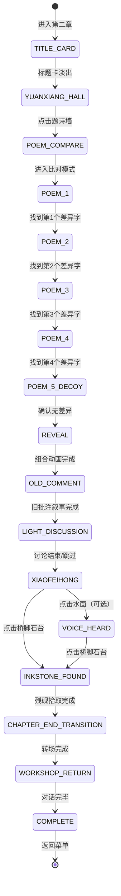

# 第二章 · 中园 —— 画中探索玩法设计文档

> **文档性质**: 玩法设计详案（非代码文档）
> **版本**: v1.0
> **最后更新**: 2026-06-15

---

## 一、设计总纲

### 1.1 核心体验目标

玩家在中园（远香堂至小飞虹）完成从"发现痕迹"到"推断参与"的认知跃迁。通过逐首比对题诗中的异文，玩家亲手拼出"画非一人"四字，自然形成"另有一人参与作画"的判断——这是一个精心设置的**误读**，将在第三章反转为"观看者"。

### 1.2 设计原则

| 原则 | 说明 |
|------|------|
| **方法教学** | 诗词比对（版本对校/异文判断）作为本章方法锚点，通过操作自然习得 |
| **误读引导** | "画非一人"的结论由玩家主动拼出，而非直接告知，增强后续反转冲击力 |
| **多感官叙事** | 小飞虹场景用水面墨涟漪文字强化"画中有声音"的世界观 |
| **渐进发现** | 5首诗逐首呈现，每完成一首解锁下一首，节奏可控 |
| **铺垫对抗** | 旧批注引入"规范化遮蔽"的对手力量——不是恶意销毁而是体例整理 |

### 1.3 第二章完整节拍表

```
┌───────────────────────────────────────────────────────────┐
│  第二章 · 中园                                             │
│                                                           │
│  ① 章节标题卡（淡入淡出）                                   │
│  ─→ ② 远香堂 · 入场探索（环境观察 + 发现题诗墙）            │
│  ─→ ③ 诗词比对谜题（逐首呈现 · 左右分栏 · 找4处差异字）    │
│  ─→ ④ "画非一人"揭示 + 旧批注浮现                          │
│  ─→ ⑤ 轻量讨论（笔记本批注 + 快捷思考）                    │
│  ─→ ⑥ 小飞虹 · 残砚与声音（水面文字 + 拾取残砚）           │
│  ─→ ⑦ 章末画面褪色转场                                     │
│  ─→ ⑧ 返回现实 · 工作室（周鹤年讲解异文方法）               │
│  ─→ ⑨ 章节结束 · 解锁第三章                                │
│                                                           │
└───────────────────────────────────────────────────────────┘
```

---

## 二、阶段详设

### 阶段 ①：章节标题卡

> **入口条件**：第一章完成后从菜单进入 / 继续游戏
> **退出条件**：标题卡动画结束（自动）

- 全屏显示章节标题「第二章 · 中园」
- 副标题「远香堂至小飞虹」
- 停留 2.5s 后淡出
- 标题卡风格：水墨淡彩底纹，与画中世界色调一致

---

### 阶段 ②：远香堂 · 入场探索

> **入口条件**：标题卡淡出完成
> **退出条件**：玩家点击题诗墙进入比对模式

#### 画面布局

```
┌──────────────────────────── 100% ────────────────────────────┐
│                                                               │
│                                              ┌──────────┐    │
│                                              │📓 修复笔记本│    │
│         远香堂场景 · 全屏展示                  │[对话|记录] │    │
│     （敞厅 + 画案 + 题诗墙 + 荷塘光影）       │[对话历史]  │    │
│                                              │[快捷按钮]  │    │
│                                              │[输入框]    │    │
│                                              └──────────┘    │
│                      【pv-feedback 浮条区】                    │
├──────────────────────────────────────────┐  ┌───┐            │
│  叙事对话框                                │  │📓│            │
│  "一片水面横在眼前，荷叶如盖……"            │  │📦│            │
└──────────────────────────────────────────┘  └───┘            │
└──────────────────────────────────────────────────────────────┘
```

#### 环境交互

| 可点击元素 | 点击反馈（pv-feedback 浮现，4s 消失） |
|-----------|--------------------------------------|
| 荷塘水面 | "水面映着天光，荷叶如盖。远处有一座红色廊桥，倒影弯弯。" |
| 画案 | "画案上有研过的墨迹，还没干透。但周围空无一人。" |
| 题诗墙 | 触发诗词比对入口叙事（见下方） |

> 荷塘为氛围元素，画案为铺垫（暗示有人刚刚在此），题诗墙为流程推进必点。

#### 题诗墙叙事（必须触发）

玩家点击题诗墙后，触发入场叙事序列（叙事对话框），引出比对谜题。叙事结束后画面切换为左右分栏比对模式。

---

### 阶段 ③：诗词比对谜题

> **入口条件**：题诗墙叙事完成
> **退出条件**：4处差异字全部找到

#### 画面布局（比对模式）

```
┌──────────────────────────── 100% ────────────────────────────┐
│                                                               │
│  ┌──── 左栏 ────┐    ┌──── 右栏 ────┐    ┌──────────┐      │
│  │              │    │              │    │📓 修复笔记本│      │
│  │  题诗（画上） │    │  参考版本    │    │[对话|记录] │      │
│  │              │    │              │    │           │      │
│  │  竖排书写     │    │  竖排书写    │    │           │      │
│  │  差异字可点击 │    │              │    │           │      │
│  │              │    │              │    │           │      │
│  └──────────────┘    └──────────────┘    └──────────┘      │
│                                                               │
│  ┌─── 底部状态 ─────────────────────────────┐  ┌───┐        │
│  │  已找到: ○ ○ ○ ○    [第 1/5 首]          │  │📓│        │
│  │  当前诗名: 《远香堂》                      │  │📦│        │
│  └───────────────────────────────────────────┘  └───┘        │
└──────────────────────────────────────────────────────────────┘
```

#### 谜题机制

**逐首呈现**：完成当前诗的比对（找到差异字或确认无差异）后，下一首才出现。

**五首诗对照表**：

| 序号 | 诗名 | 画上版本（含差异字） | 参考版本 | 差异字 | 类型 |
|------|------|---------------------|---------|--------|------|
| 1 | 《远香堂》 | "荷风送香气，**画**影落清池" | "荷风送香气，**锁**影落清池" | 画 | 有效 |
| 2 | 《小飞虹》 | "虹桥卧碧水，**非**梦亦非烟" | "虹桥卧碧水，**自**梦亦非烟" | 非 | 有效 |
| 3 | 《梧竹幽居》 | "竹影横窗**一**径深" | "竹影横窗**旧**径深" | 一 | 有效 |
| 4 | 《听雨轩》 | "雨声入梦**人**不知" | "雨声入梦**园**不知" | 人 | 有效 |
| 5 | 《倚虹亭》 | "凭栏远眺烟水阔" | "凭栏远眺烟水阔" | — | 诱饵（无差异） |

**操作方式**：
- 左栏每个字均可点击；右栏仅供参照，不可交互
- 点击正确差异字 → 该字高亮金色 + 收入底部进度槽 + pv-feedback 确认
- 点击非差异字 → 该字短暂闪红(0.3s) + pv-feedback："这个字两边一样。"
- 诱饵诗（第5首）底部出现「确认无差异」按钮，点击后完成该首

**进度指示**：
- 底部显示 4 个圆形槽位，每找到一个差异字点亮一个
- 当前诗序号 / 总数 显示在右下

#### 渐进提示

| 触发条件 | 提示内容 |
|---------|---------|
| 当前诗停留 20s 未找到差异 | pv-feedback："逐字对比，不要凭记忆。" |
| 当前诗停留 40s 未找到差异 | 差异字所在行轻微脉动高亮 |
| 当前诗停留 60s 未找到差异 | 差异字本身脉动高亮（几乎直接指出） |
| 第5首（诱饵）停留 15s | pv-feedback："这一首……好像没有不同。" |

---

### 阶段 ④："画非一人"揭示 + 旧批注

> **入口条件**：第5首诗比对完成（4个差异字已全部收集）
> **退出条件**：旧批注叙事播放完毕

#### 揭示流程

4个差异字全部找到后：
1. 画面回到远香堂全景
2. 底部4个差异字从圆形槽位飞出，在画面中央纵向排列组合
3. 组合动画（1.2s）：「画 · 非 · 一 · 人」
4. 叙事对话框播放沈念理解这四个字的内心独白
5. 笔记本自动记录

**自动记录内容**：
- `[线索] 题诗异文 — 五首题诗中四处差异字组合为"画非一人"，似乎暗示这套画作并非一人完成`

#### 旧批注浮现

组合揭示后短暂停留，画面右上角浮现一片泛黄纸片（旧批注残片）：

> "此页视点卑近，似非成稿。画心尚佳，惟边旁杂线、残字、旧签皆碍全册体例，宜配边压覆……"

叙事对话框播放沈念对旧批注的反应（这不是恶意评价，而是一个整理者的"体例判断"）。

**自动记录内容**：
- `[线索] 旧批注残片 — "此页视点卑近，似非成稿……宜配边压覆"。不是恶意的销毁，而是规范化的遮蔽`

**状态写入**：`foundOldComment = true`

---

### 阶段 ⑤：轻量讨论（谜题完成后）

> **入口条件**：旧批注叙事播放完毕
> **退出条件**：玩家结束讨论（自由退出，非强制通过）

#### 触发方式

旧批注叙事结束后，笔记本面板自动展开，对话区显示周老师的预置批注：

> *（周老师的批注）"画非一人"——你是第一个这么读的人。大多数研究者把这些差异当作传抄讹误，但你把它们并在一起读出了一个句子。这个方法叫"异文串读"。现在的问题是：这句话是谁留下的？它在对谁说？*

#### 讨论机制

| 要素 | 说明 |
|------|------|
| AI 身份 | 修复笔记本中周鹤年预置的批注（非实时对话） |
| 快捷按钮 | "留下这句话的人参与了作画" / "旧批注说'视点卑近'，这和断簪的主人有关吗？" / "跳过讨论" |
| 讨论轮数 | 无强制要求，玩家可随时点击"跳过讨论"或收起面板 |
| 引导方向 | 引导玩家自然形成"蘅参与了绘画"的判断（误读），同时用旧批注暗示有人试图遮蔽这些痕迹 |
| 离线降级 | 快捷按钮点击后显示预置降级回复文本 |

#### 讨论结束

玩家点击"跳过讨论"或收起笔记本后，叙事对话框播放过渡旁白 → 场景切换至小飞虹。

> [!NOTE]
> 轻量讨论不设门槛判定。目的是巩固"画非一人"的认知，并让旧批注留下印象。即使完全跳过也不影响主线推进。

---

### 阶段 ⑥：小飞虹 · 残砚与声音

> **入口条件**：从远香堂轻量讨论结束后转场
> **退出条件**：残砚拾取完成

#### 画面布局

```
┌──────────────────────────── 100% ────────────────────────────┐
│                                                               │
│                                              ┌──────────┐    │
│                                              │📓 修复笔记本│    │
│         小飞虹场景 · 全屏展示                  │[对话|记录] │    │
│     （红色廊桥 + 两侧水面 + 桥下暗处）        │[对话历史]  │    │
│                                              │           │    │
│                    ✦ 残砚（桥脚石台上）        │           │    │
│                                              └──────────┘    │
│             ～～ 水面 ～～  ← 可点击                          │
│                      【pv-feedback 浮条区】                    │
├──────────────────────────────────────────┐  ┌───┐            │
│  叙事对话框                                │  │📓│            │
│  "一座红色廊桥横跨水面……"                  │  │📦│            │
└──────────────────────────────────────────┘  └───┘            │
└──────────────────────────────────────────────────────────────┘
```

#### 入场叙事

进入小飞虹后，叙事对话框自动播放旁白，描述廊桥环境。

#### 水面文字交互（点击触发）

桥两侧水面区域为可点击热点。玩家点击水面后：

1. 水面泛起墨色涟漪动画（1.5s）
2. 涟漪间隙中逐字浮现文字：「……知我者，唯有此园。」
3. 文字显现完成后逐渐溶入水中消失（3s）
4. 叙事对话框播放沈念的反应

**状态写入**：`heardVoice = true`

**自动记录**：
- `[线索] 水面回声 — 小飞虹桥下墨涟漪浮现文字"知我者，唯有此园"。像是某个人留在水里的声音`

#### 残砚发现与拾取

水面文字触发后（或玩家直接探索时），桥脚石台处出现微弱光点提示。

| 操作 | 响应 |
|------|------|
| 点击桥脚石台光点 | 叙事对话框播放发现残砚的描述 |
| 拾取确认 | 残砚飞入物件匣 + 叙事描述砚背小词 |

**拾取后叙事**：沈念翻过残砚，发现砚背刻有小词——"园深不知处，花落有谁怜。画里青山在，无人识旧年。"

**自动记录**：
- `[物件] 残砚 — 小型端砚，砚池残留朱砂。砚背刻有小词："园深不知处，花落有谁怜。画里青山在，无人识旧年。"不是正式作画工具，更像一个人的私人用砚`

**状态写入**：`hasInkstone = true`

> [!IMPORTANT]
> 水面文字和残砚拾取无强制顺序。但水面文字交互不是必须——玩家可以不点水面直接拾取残砚。`heardVoice` 为可选标记，不阻塞主线。残砚拾取为必须操作（触发章末转场的前提条件）。

#### 渐进提示

| 触发条件 | 提示内容 |
|---------|---------|
| 进入小飞虹 20s 未点击任何位置 | pv-feedback："桥两侧的水面很静，静得不太自然。" |
| 进入小飞虹 40s 未拾取残砚 | 桥脚光点脉动加强 + pv-feedback："桥脚的石台边好像有什么东西。" |
| 水面文字触发后 15s 未拾取残砚 | pv-feedback："声音消散了。但留下声音的人，也留下了别的东西。" |

---

### 阶段 ⑦：章末画面褪色转场

> **入口条件**：残砚拾取完成
> **退出条件**：转场动画完成

#### 转场流程

```
残砚拾取完成
    │
    ▼
叙事对话框：章末过渡旁白（2 段，点击推进）
    │
    ▼
画面逐渐褪色（水墨色调 → 灰白 → sepia）
    │
    ▼
画面淡出（1.2s fade-out）
    │
    ▼
切换到阶段 ⑧ 工作室场景
```

#### 转场视觉

| 阶段 | 时长 | 效果 |
|------|------|------|
| 色调褪变 | 1.0s | 画中世界暖色调逐渐褪为灰白 sepia |
| 画面淡出 | 1.2s | opacity 渐变至 0 |
| 场景切换 | 0s | 替换为工作室场景 |
| 新场景淡入 | 0.8s | 工作室场景 opacity 从 0 渐变至 1 |

---

### 阶段 ⑧：返回现实 · 工作室

> **入口条件**：转场完成
> **退出条件**：周鹤年对话全部播放完毕

#### 画面布局

```
┌──────────────────────────── 100% ────────────────────────────┐
│                                                               │
│                                              ┌──────────┐    │
│                                              │📓 修复笔记本│    │
│         工作室背景（复用 prologue-bg）          │[对话|记录] │    │
│                                              │[对话历史]  │    │
│                                              │           │    │
│                                              └──────────┘    │
│                                                               │
├─────┬────────────────────────────────┐  ┌───┐               │
│立绘 │ 周鹤年                          │  │📓│               │
│周鹤年│ "异文，不是错字。"              │  │📦│               │
└─────┴────────────────────────────────┘  └───┘               │
└──────────────────────────────────────────────────────────────┘
```

#### 对话内容

周鹤年在叙事对话框中讲解"异文方法"：

1. 周鹤年问玩家发现了什么
2. 沈念汇报"画非一人"
3. 周鹤年解释异文判断方法——"一个字是巧合，一句话是线索，一条证据链才是判断的依据"
4. 周鹤年指出：这些差异不像自改，更像"有人借他的诗，嵌入了另一重读法"
5. 周鹤年提醒：现在只有四个字，还不够构成证据链，需要在下一处找到物质证据

#### 方法锚点记录

对话结束后，笔记本记录 Tab 自动追加：

> *（周老师的方法）版本比对与异文判断：逐字对照不同版本的同一文本，找出差异字。一个字是巧合，一句话是线索，一条证据链才是判断的依据。*

---

### 阶段 ⑨：章节结束

> **入口条件**：周鹤年对话播放完毕
> **退出条件**：玩家点击返回菜单

#### 结束流程

1. 对话结束后，画面短暂停留（2s）
2. 屏幕中央渐入章节结束卡：「第二章 · 中园 · 完」
3. 下方出现按钮：「返回菜单」
4. 菜单中"第三章"按钮解锁

#### 状态保存

章节结束时写入 `gameProgress`：
- `chapter2Complete = true`
- `hasInkstone = true`（残砚已获得）
- `poemDiffsFound = 4`
- `foundOldComment = true`
- `heardVoice = true | false`（取决于玩家是否点击水面）

---

## 三、状态机总览



### 状态变量追踪

| 变量 | 类型 | 写入时机 | 用途 |
|------|------|---------|------|
| `currentSubScene` | string | 每次切换子场景 | 记录当前位置（yuanxiang/xiaofeihong/workshop） |
| `poemDiffsFound` | int(0-4) | 每找到一个差异字 | 追踪谜题进度 |
| `currentPoemIndex` | int(0-4) | 每完成一首诗 | 控制逐首呈现 |
| `foundOldComment` | bool | 旧批注叙事触发后 | 标记旧批注已发现 |
| `heardVoice` | bool | 小飞虹水面文字触发后 | 可选叙事标记 |
| `hasInkstone` | bool | 残砚拾取后 | 物件匣中残砚可用 |
| `chapter2Complete` | bool | 章节结束时 | 解锁第三章 |

> [!IMPORTANT]
> `currentSubScene`、`currentPoemIndex` 为运行时变量，不写入 `gameProgress` 存档。`poemDiffsFound`、`foundOldComment`、`heardVoice`、`hasInkstone`、`chapter2Complete` 需要持久化。

---

## 四、边界情况与容错

| 场景 | 处理方式 |
|------|---------|
| 玩家在远香堂不点题诗墙 | 题诗墙光点持续提示；其他元素可点但不推进流程 |
| 玩家反复点击非差异字 | 每次闪红+反馈；第5次起追加"试试逐字对比" |
| 玩家在诱饵诗上找不到差异 | 15s后提示"好像没有不同"；30s后「确认无差异」按钮脉动 |
| 玩家在小飞虹不点水面直接拾取残砚 | 正常放行，`heardVoice` 保持 false |
| 玩家拾取残砚后再点水面 | 仍可触发水面文字（补充体验），但不影响流程 |
| 玩家在轻量讨论中 AI 不可用 | 快捷按钮触发降级回复文本 |
| 玩家在工作室对话中按 Esc | 弹出确认："对话尚未结束，确定返回菜单？" |
| 窗口大小变化 | 重新计算诗词分栏布局和可点击区域 |
| 玩家重玩第二章 | 允许重玩，不覆盖已有 `gameProgress` |

---

## 五、叙事整合要点

### 与核心逻辑的一致性

> 核心逻辑：第三十一景的画面保留了王蘅发现的低位视角；文徵明以自己的笔保存了她的眼睛。后人并没有重画此景，而是在重装、配边、归档过程中遮蔽了说明这个视角来源的边注、题签、辅助线和残字。

第二章在证据链中的位置：

```
第一章：断簪"蘅"字  →  有人留下了私人记号
第二章：题诗异文"画非一人" →  此人参与了这套画（误读！）
第二章：旧批注"视点卑近，宜配边压覆" →  有人在遮蔽痕迹
第二章：残砚朱砂+砚背词 →  此人有自己的绘画工具（强化误读）
第三章将反转：她不是画家，而是观看者
```

第二章的叙事目标：
1. 让玩家确信"蘅"不仅留了痕迹，而且参与了作画
2. 引入对手力量——规范化遮蔽（旧批注）
3. 通过残砚建立物质证据链（朱砂将在第三章与墙上旧线条呼应）

### AI 对话的叙事约束

轻量讨论中 AI 的回复应当：

- ✅ 肯定"异文串读"的方法（逐字对比发现隐藏信息）
- ✅ 引导玩家联想第一章的"蘅"字（断簪主人=画中参与者？）
- ✅ 解释旧批注的性质——不是恶意，而是体例规范
- ❌ 不直接否定"画非一人=另有画家"的判断
- ❌ 不提前揭示"观看者"真相
- ❌ 不解释砚背词的完整含义（留给第三章）

---

## 六、文件变更清单

| 操作 | 文件 | 说明 |
|------|------|------|
| **新建** | `src/pages/chapter2-paint.js` | 第二章画中世界主场景（远香堂+诗词比对+小飞虹） |
| **新建** | `src/pages/chapter2-workshop.js` | 第二章章末工作室场景（周鹤年异文方法讲解） |
| **新建** | `src/components/poem-compare.js` | 诗词比对组件（左右分栏+逐字点击+进度显示） |
| **新建** | `src/styles/poem-compare.css` | 诗词比对组件样式 |
| **修改** | `src/core/game-engine.js` | 注册 chapter2-paint / chapter2-workshop 场景 |
| **修改** | `src/core/scene-manager.js` | 复用第一章画中→现实转场 |
| **修改** | `src/components/narration-bar.js` | 无新功能，复用现有能力 |
| **修改** | `src/components/notebook-floating.js` | 轻量讨论触发（复用第一章模式） |
| **修改** | `src/core/inventory.js` | 新增"残砚"物件定义 |
| **修改** | `src/core/ai-prompts.js` | 新增第二章 AI 身份提示词 |
| **修改** | `src/data/knowledge-snippets.js` | 新增第二章解锁的知识片段 |
| **修改** | `src/styles/index.css` | 新增诗词比对模式过渡动画、墨涟漪动画 |

---

## 七、跨章节样式规范（第二章及后续章节必须遵守）

### 7.1 继承规则

以下样式和模式由序章与第一章确立，**第二章本身及后续章节（第三章、终章）MUST 完全延续**，不得擅自变更：

| 规范项 | 具体要求 |
|--------|----------|
| 画面布局 | 游戏画面100%全屏；叙事对话框底部55%宽居中；笔记本面板右侧360px可收缩；HUD按钮栏右下角（📓📦） |
| 台词标记体系 | 【旁白】【周鹤年】【沈念·内心】【系统提示】【浮条】五种标记，含义和渲染方式不变 |
| 浮条机制 | pv-feedback 浮现于画面中央偏下，4s后自动消失，不阻塞操作 |
| 渐进提示模式 | 三级提示（方向→关键线索→几乎直给），由idle时长触发，不设硬失败 |
| 转场规则 | 子场景间：0.6s平移/淡出；画中→现实：色调褪变(1.0s)+淡出(1.2s)+淡入(0.8s) |
| 章节标题卡 | 全屏水墨淡彩底纹，主副标题，停留2.5s淡出 |
| 章节结束卡 | 「第X章 · XX · 完」+ 返回菜单按钮 |
| 轻量讨论模式 | 笔记本自动展开，周老师预置批注+快捷按钮+可跳过，不设门槛判定 |
| 章末工作室 | 复用prologue-bg，周鹤年在叙事对话框中对话，含方法锚点记录 |
| 物件拾取流程 | 叙事描述→拾取动画→飞入物件匣→系统提示→笔记本自动记录 |
| 笔记本记录格式 | `[线索] 名称 — 描述` / `[物件] 名称 — 描述` / `（周老师的方法）内容` |
| 光点提示 | 可交互元素以微弱光点提示，必点元素光点常驻，可选元素光点较弱 |
| 画中世界图片风格 | 水墨淡彩、暖旧色调、纸纹质感、永恒午后光感、1920×1080 |
| 状态变量命名 | 驼峰命名；运行时变量不写入gameProgress；持久化变量写入gameProgress |
| 探索态入场提示 | 每次进入新探索态时，MUST 弹一条【系统提示】告知玩家可打开笔记本查看线索/讨论，同时更新笔记本快捷问题为与当前场景相关的2-3个预设问题 |
| 线索获得提示 | 每次获得新线索/物件后，MUST 弹【系统提示】告知"已写入笔记本，可在记录页查看，也可在对话页继续讨论" |

### 7.2 可变内容（各章独有）

以下内容为各章节独有，不受继承约束：

- 台词文案（剧情文本）
- 谜题交互机制（每章独有的核心玩法组件）
- 子场景数量与名称
- 背景图内容与构图
- 环境可点击元素的种类和位置
- AI讨论引导方向与快捷按钮文案
- 知识片段内容

### 7.3 前置章节保护规则（P0）

> [!IMPORTANT]
> **在制作或修改第二章及后续章节时，MUST NOT 修改已完成的前置章节（序章、第一章）的任何代码和文档。** 具体约束：
>
> 1. **禁止修改已完成场景文件**：`prologue.js`、`chapter1-paint.js`、`chapter1-workshop.js`
> 2. **禁止修改已完成组件的已有行为**：`narration-bar.js`、`notebook-floating.js`、`hud-bar.js`、`inventory-popup.js`、`painting-viewer.js` 的现有接口和渲染逻辑不得因当前或后续章节需要而改变
> 3. **禁止修改已完成文档**：`序章_残页_玩法设计.md`、`序章_残页_场景制作.md`、`第一章_东园_玩法设计.md`、`第一章_东园_场景制作.md`
> 4. **允许的修改方式**：向公共模块**追加**新功能（新方法、新配置项），但已有方法的签名和行为保持不变
> 5. **允许新建文件**：当前及后续章节应通过新建场景文件和组件实现独有玩法，而非改造已有文件
>
> **理由**：已完成章节经过测试验证，修改可能引入回归bug。每章应当自包含——通过引擎注册和公共组件的稳定API接入，而非侵入式修改。
