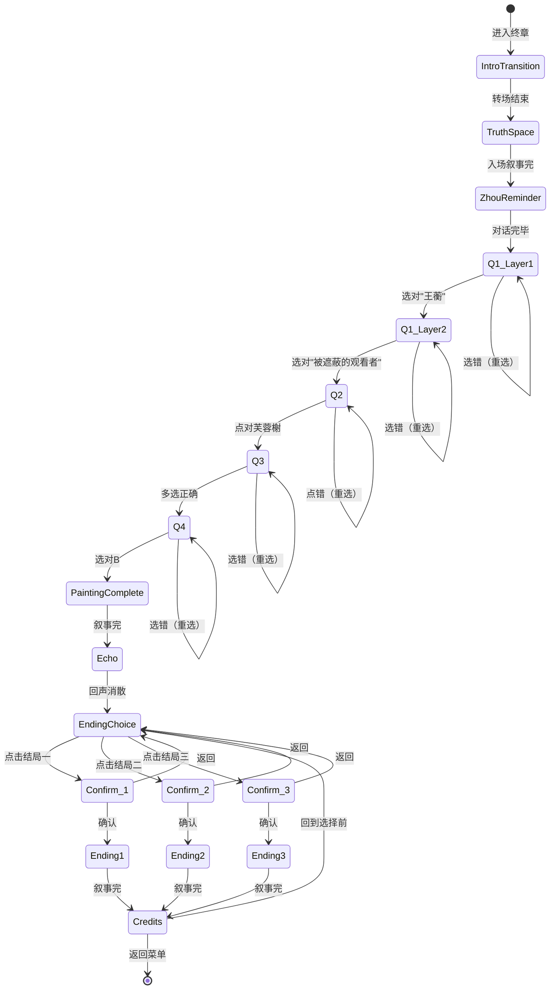

# 终章 · 第三十一景 — 玩法设计

> **文档性质**：分章节实现详设  
> **版本**：v1.0  
> **更新日期**：2026-06-19  
> **前置依赖**：序章+第一章+第二章+第三章已实现；玩家持有断簪、残砚、草图拓片、王蘅的信四个物件

---

## 一、设计总纲

### 1.1 核心体验目标

| 维度 | 目标 |
|------|------|
| 情感 | 从紧张的"能否复原"→ 复原后的释然 → 回声中的共鸣 → 结局选择时的两难 |
| 认知 | 完成全部证据链的逻辑闭环：谁在看/从哪里看/看见什么/为什么被遮蔽 |
| 操作 | 四问答题（选择+点击+多选+选择）+ 结局选择（混合式三选一+二次确认）|
| 节奏 | 周鹤年提醒（沉静）→ 四问递进（紧凑）→ 画面完成（高潮）→ 回声（情感峰值）→ 结局（沉思抉择）|

### 1.2 设计原则

| 原则 | 说明 |
|------|------|
| 回顾即答案 | 四问的答案来自前三章积累的线索，不需要新信息 |
| 不设硬失败 | 答错不惩罚，给反馈引导重新作答 |
| 结局无优劣 | 三结局平等，选择前充分告知代价，不引导特定结局 |
| 仪式感收束 | 终章节奏慢于前三章，留足情感空间 |
| 空间诗意化 | 真相空间不是具体地点而是抽象的"修复行为的终极形态" |

### 1.3 完整节拍表

```
入场转场 ──→ 真相空间（环境认知 + 周鹤年最后提醒）
    │
    ↓
四问复原谜题：
  问题一「谁在看？」（两层结构）
  ──→ 问题二「从哪里看？」（俯瞰图点击）
  ──→ 问题三「看见了什么？」（多选景物）
  ──→ 问题四「为什么没人知道？」（单选）
    │
    ↓
第三十一景完成叙事 ──→ 回声
    │
    ↓
结局选择（混合式三选一）──→ 犹豫提示（narrationBar内确认）
    │
    ├──→ 结局一「存档」（褪色转场→工作室）
    ├──→ 结局二「守密」（褪色转场→工作室）
    └──→ 结局三「续笔」（宣纸铺开转场→拙政园实景）
    │
    ↓
片尾声明 ──→ 结束卡（可回退重选 / 返回菜单）
```

---

## 二、阶段详设

### 阶段 ①：入场转场

> **入口条件**：第三章完成，从菜单/存档进入终章  
> **退出条件**：转场动画结束，进入真相空间

复用 `intro-transition-overlay` 组件，但**使用纯黑底色**（区别于前三章的浅色/暗色底）：

- 标题：「终章 · 第三十一景」
- 引言（逐行浮现）：
  - "断簪、残砚、草图、信——散在五百年里的碎片。"
  - "不是找回一幅失踪的画，而是复原一种被遮蔽的观看。"
  - "文徵明的笔。王蘅的眼睛。"
  - "现在，由你来决定它们该怎样被世人知道。"
- 可跳过（点击任意处或等待自动播完）

#### 画面布局

```
┌─────────────────────────────────────────┐
│           （全屏纯黑底渐显）              │
│                                         │
│          终章 · 第三十一景               │
│                                         │
│     "断簪、残砚、草图、信……"          │
│     "不是找回一幅失踪的画……"          │
│     "文徵明的笔。王蘅的眼睛。"          │
│     "现在，由你来决定……"              │
│                                         │
│              [点击跳过]                  │
└─────────────────────────────────────────┘
```

---

### 阶段 ②：真相空间 + 周鹤年最后提醒

> **入口条件**：入场转场结束  
> **退出条件**：周鹤年对话播放完毕

#### 画面布局

```
┌─────────────────────────────────────────┐
│                                         │
│       （真相空间：宣纸白底 + 拙政园      │
│         俯瞰线图 + 悬浮物件/文字）       │
│                                         │
│   左侧悬浮：                            │
│     "画非一人。"                        │
│     "此页视点卑近，似非成稿。"          │
│                                         │
│   右侧悬浮：                            │
│     [断簪] [残砚] [草图拓片]            │
│                                         │
├─────────────────────────────────────────┤
│  ┌──── narrationBar (55%宽居中) ────┐   │
│  │ 【周鹤年】到这里，你已经不能只… │   │
│  └──────────────────────────────────┘   │
└─────────────────────────────────────────┘
```

#### 入场叙事（自动播放）

- 【沈念·内心】"只要有痕迹。"……这句话从昨晚起就一直压在脑子里，怎么也放不下。
- 【沈念·内心】写进报告，还是不写？我到现在也没有答案。
- 【旁白】扫描件还停在昨天的位置。第三十一景的表层画面安静地等在屏幕上，和五百年来一样完整，一样沉默。
- 【旁白】你盯着它看了很久。忽然墨迹开始流动——像水，像呼吸。这一次，你没有闭眼。
- 【旁白】脚下不是青石板，不是泥路，不是任何一处你曾走过的地方。四周是一片宣纸般的空白——没有天空，没有地面，只有极淡的纸纹。
- 【旁白】面前浮现出拙政园的俯瞰线图。芙蓉榭、远香堂、小飞虹、梧竹幽居，像几个尚未落墨的点。
- 【旁白】右侧悬着三样东西：断簪、残砚、草图拓片。左侧悬着两行字：「画非一人」「此页视点卑近，似非成稿」。
- 【沈念·内心】所有找到的痕迹……都在这里了。该把它们放回原来的位置了。

#### 周鹤年声音（入场叙事结束后自动触发）

- 【周鹤年】到这里，你已经不能只做技术判断了。
- 【周鹤年】你手里的东西，足够让人相信有另一个观看者。但未必足够让所有人承认她。
- 【周鹤年】修复报告不是小说。你写下的每一个字，都要负责。
- 【周鹤年】但你不写，也是一种判断。
- 【周鹤年】其实，三十年前我第一次见到那个"蘅"字，也没有写进报告。我告诉自己是谨慎。现在回头看，谨慎和回避长得太像了。
- 【周鹤年】那时我也只是跟在老师身后的学生，以为少写一句不会改变什么。
- 【周鹤年】所以，我没有资格替你选。

> 周鹤年对话结束后，场景进入等待状态。笔记本面板自动展开（记录页展示此前全部线索/物件）。

- 【系统提示】所有线索已汇聚。当你准备好了，点击「开始复原」回答关于第三十一景真相的四个问题。

> 笔记本快捷问题（供玩家最后回顾）：
> - "断簪、残砚、草图、信件——它们之间的关系是什么？"
> - "第三十一景的视角为什么和前三十景不同？"
> - "后人是怎样把来源痕迹遮蔽的？"
>
> 画面下方居中出现「开始复原」按钮。玩家点击后进入四问模式。

#### 状态写入

- `enteredTruthSpace = true`
- `heardZhouReminder = true`

---

### 阶段 ③：四问复原谜题

> **入口条件**：周鹤年对话完毕  
> **退出条件**：四问全部答对

#### 谜题总体机制

- 每答对一题，画面浮现一部分景色（从俯瞰线图逐渐"着色"为完整画面）
- 答错不计入惩罚，给出视觉反馈（画面局部褪色/墨纹回缩）+ 引导文字，允许重选
- 答对后进入下一题，不可回退已答对的题目

#### 问题一：「谁在看？」（两层结构）

##### 第一层

- 【系统提示】第一问：第三十一景保存的是谁的视角？

选项呈现（纵列排布）：
- A. 王献臣——他是拙政园的主人
- B. 王蘅——画中痕迹指向的那个人
- C. 文徵明——他是这套画的作者
- D. 后世经手此画的人——他曾重新装裱这页画

正确答案：B

错误反馈：
- 选A：【浮条】他拥有这座园。但拥有一座园，不等于发现了怎么看它。
- 选C：【浮条】他画了这幅画。但视角是他自己发现的吗？
- 选D：【浮条】装裱师是后来者。这个视角比装裱早了几百年。

答对反馈：
- 【旁白】画面微微亮了一层——俯瞰线图中，芙蓉榭的位置浮现出淡淡的墨迹。

##### 第二层（选B后自动追问）

- 【系统提示】她对第三十一景的贡献是什么？

选项呈现：
- A. 她是被遮蔽的观看者——她发现了这个视角，文徵明用自己的笔保存了它
- B. 她是未署名的执笔者——第三十一景由她亲手绘制
- C. 她是画作的构思者——构图与立意都源于她的设计

正确答案：A

错误反馈：
- 选B：【浮条】回想留听阁墙上那幅草图——线条犹豫，比例失准。她的手不足以画出第三十一景的笔墨。
- 选C：【浮条】构图和立意仍是文徵明的判断。她提供的比"设计"更基础——是一个位置，一种看法。

答对反馈：
- 【沈念·内心】对。她提供的不是笔，不是构图方案，而是一个从未被采纳过的观看位置。他用自己的手保存了她的眼睛。

#### 问题二：「从哪里看？」

- 【系统提示】第二问：她从园中哪个位置看出去，才能让三处景物同时入画？

画面变化：俯瞰线图放大至可交互状态，标注5个热点位置（附简要说明）：
- 远香堂正厅——面向荷塘的主要观赏位
- 小飞虹桥中央——横跨水面的高处
- **芙蓉榭栏杆下**——临水低处，视线贴近水面（正确）
- 梧竹幽居亭内——竹林掩映的静处
- 缀云峰顶——东园最高的假山

正确答案：芙蓉榭栏杆下

错误反馈：
- 选远香堂：【浮条】站在远香堂只能看见正前方的荷塘。三景不会同时出现。
- 选小飞虹：【浮条】桥上看得远，但视线太高。回想草图标注的那条线——它很低。
- 选梧竹幽居：【浮条】竹林遮蔽了远处。要看到三景，得在开阔处。
- 选缀云峰：【浮条】从高处俯瞰是文人画常见的观法。但这幅画的特殊之处恰恰是：视角很低。

答对反馈：
- 【旁白】从芙蓉榭的位置向远处延伸出一束淡墨视线。远香堂、小飞虹、梧竹幽居三处的轮廓渐渐清晰。

#### 问题三：「看见了什么？」

- 【系统提示】第三问：从那个位置看，能看见什么？（多选，选完后点击确认）

选项呈现（带小图标的多选按钮）：
- ☐ 远香堂的倒影
- ☐ 小飞虹的弧线
- ☐ 梧竹幽居的竹影
- ☐ 兰雪堂正门
- ☐ 卅六鸳鸯馆匾额

正确答案：前三项

错误反馈：
- 多选/少选：【浮条】回想草图上画了什么——"水桥竹影，三景同入一眼"。

答对反馈：
- 【旁白】三处景物同时着色——倒影、弧线、竹影在画面中浮现，相互照应。第三十一景几乎完成了。

#### 问题四：「为什么没人知道？」

- 【系统提示】第四问：第三十一景一直存在，为什么五百年来没人发现视角来自她？

选项呈现：
- A. 文徵明故意隐瞒了她的贡献
- B. 画面本身没有变，但说明来源的边注、题签和辅助线被后人装裱时压覆遮蔽了
- C. 画心被后人重画过，原本的视角信息被替换了
- D. 她的痕迹太少，从来没有被任何人注意到过

正确答案：B

错误反馈：
- 选A：【浮条】他没有"故意隐瞒"——是当时的体例里根本写不下这件事。他已经做了他能做的。
- 选C：【浮条】画心从未被重画。第三十一景的画面一直在那里，问题出在画面之外。
- 选D：【浮条】不是没人注意到——旧批注写了"视点卑近"。他注意到了，只是用"配边压覆"把它处理掉了。

答对反馈：
- 【旁白】最后一笔落下。

#### 状态写入

- 每答对一问写入对应标记：`q1Correct`、`q2Correct`、`q3Correct`、`q4Correct`
- 全部答对：`allQuestionsAnswered = true`

---

### 阶段 ④：第三十一景完成叙事

> **入口条件**：`allQuestionsAnswered === true`  
> **退出条件**：完整画面呈现 + 叙事播放完毕

#### 画面变化

俯瞰线图完全转化为一幅完整的第三十一景画面——从芙蓉榭栏杆下的低位视角望出去的构图。画面着色动画2.0s。

#### 叙事（自动播放）

- 【旁白】一幅完整的画在你面前展开：从芙蓉榭栏杆下望出去，远香堂的倒影、小飞虹的弧线、梧竹幽居的竹影，全都在同一个画面里。
- 【沈念·内心】这个角度……和留听阁墙上那幅拙劣的草图一模一样。水面太重，桥线太弯，亭阁压得太低——当时觉得哪里都不对的画面，原来是从这里看过去的。
- 【沈念·内心】但眼前这幅画不拙。笔墨成熟、稳定，每一笔都是文徵明的手。
- 【沈念·内心】这就是第三十一景。他没有用她的画法，而是站在她标出的那个位置上，用自己的笔重新画了一遍她看见的东西。
- 【沈念·内心】他为什么要这样做？……也许他知道，以她的笔力，这个视角永远不会被收入任何正式图册。如果他不画，这个角度就消失了。
- 【沈念·内心】可他也没有办法写下"这是另一个人的眼睛"。在那套图册的体例里，根本没有一行能容纳这件事。他大概想过，又放下了笔。
- 【沈念·内心】所以它就这样留了下来——笔墨精良，体例完整，像前三十景一样被归入文徵明名下。后来的人看见这一页的视角很低、很怪，但画心如此完美，谁会怀疑它背后还有别的来历？
- 【沈念·内心】那些本可以说明来历的边注、辅助线、残字，在一次又一次的重装和归档中被"整理"掉了。它们在规范面前不够体面。
- 【沈念·内心】芙蓉榭倒影里的断簪、远香堂下的残砚、留听阁墙上的草图、兰雪堂匾额上那道多余的笔画……它们散在园子各处，谁也不挨着谁。可现在我明白了——它们出自同一只手、同一种心思，在五百年里一遍遍极轻地说着同一句话：我也在这里看过。

#### 状态写入

- `painting31Restored = true`

---

### 阶段 ⑤：回声

> **入口条件**：第三十一景完成叙事播放完毕  
> **退出条件**：回声文字消散

#### 呈现方式

画面完整展示第三十一景。短暂静默（2s）后，画面底部缓缓渗出墨字（复用第三章渗字效果，但速度更慢：500ms/字）。

#### 叙事

- （静默 2s）
- 【旁白】画完成的瞬间，你听到她的声音。不是从水底传来，也不是从墙后传来。
- 【旁白】像是很久很久以前，有人对着空无一人的园子，轻轻问出的一句话，隔了五百年，终于落了地：
- 【渗字·强调】"有人，终于看到了。"
- 【旁白】没有惊喜，没有悲伤。只是一句等了很久的确认。她不会知道是你，但因为有人来过，她当年那一问，不再悬空。

> 渗字消散后（3s），画面上方浮现一行字：「三条路代表三种立场。没有绝对对错，只有你如何承担自己的解释。」

#### 状态写入

- `heardEcho = true`

---

### 阶段 ⑥：结局选择

> **入口条件**：回声叙事完成  
> **退出条件**：玩家选定并确认一个结局

#### 呈现方式（混合式）

提示语消散后，画面中央浮现三枚竖式墨字卡片，纵向均匀分布，每枚卡片包含：
- 一行主文字（结局选项文案）
- 下方一行小字（结局立场简述）

```
┌─────────────────────────────────────────┐
│                                         │
│    （第三十一景画面作为底衬，略暗）       │
│                                         │
│         ┌──────────────────┐            │
│         │"我会在修复报告里  │            │
│         │  记下这个可能性。"│            │
│         │  ── 历史正义 ──  │            │
│         └──────────────────┘            │
│                                         │
│         ┌──────────────────┐            │
│         │"有些痕迹，        │            │
│         │  被看见就够了。"  │            │
│         │  ── 私人守护 ──  │            │
│         └──────────────────┘            │
│                                         │
│         ┌──────────────────┐            │
│         │"我想画一幅新的画。"│            │
│         │  ── 当代续写 ──  │            │
│         └──────────────────┘            │
│                                         │
└─────────────────────────────────────────┘
```

#### 交互流程

1. 三枚卡片浮入（0.8s依次淡入，间隔0.3s）
2. 玩家点击任一卡片
3. 叙事对话框（narrationBar）播放对应结局的犹豫提示文本
4. 对话框上方出现两个按钮：[确认选择] [返回]

#### 犹豫提示文本

| 结局 | 犹豫提示 |
|------|---------|
| 存档 | "她说过'不必有名，不必有形'。你确定要替她做一个她没有要求的决定吗？" |
| 守密 | "如果你不说，也许永远不会有人知道她存在过。历史会继续沉默。你能接受吗？" |
| 续笔 | "你可以不替历史下结论，也不替她守住沉默。你只回应她的观看。但这幅新画，终究会带上你的解释。" |

#### 操作逻辑

- 点击[返回]：对话框收起，回到三选一状态
- 点击[确认选择]：进入对应结局阶段

#### 状态写入

- `endingChoice = 1 | 2 | 3`

---

### 阶段 ⑦a：结局一「存档」— 历史正义

> **入口条件**：`endingChoice === 1`  
> **退出条件**：结局文本播放完毕

#### 转场

褪色转场（复用前三章规则）：真相空间色调褪变 1.0s → 淡出 1.2s → 工作室淡入 0.8s

#### 结局叙事

- 【旁白】你回到工作室。修复报告窗口仍然打开，光标停在"附注"一栏。
- 【旁白】你写下：
- 【引用·强调】"第三十一景表层图像整体稳定，然页边装裱层下可见旧题签残痕与低位辅助线。结合画中视点、题诗异文及相关残迹，不排除该景保存了一位未被记录的观看提供者之视角。此判断仍需进一步考证。"
- 【旁白】报告被收入档案。没有学术震动，没有新闻报道。
- 【旁白】但从此，档案中第一次出现了"未被记录的观看提供者"这一可能性。
- 【旁白】画中园林安静下来。风过荷塘，水面上浮起几片蘅芜叶子，转了一个圈，又沉了下去。
- 【引用·强调】"有人看到了。"

#### 结局卡

> 「结局一 · 存档」
> 她等了五百年。你在档案里为她留了一行字。
> 也许没有人会读到。但从此，沉默不再是唯一的记录。

---

### 阶段 ⑦b：结局二「守密」— 私人守护

> **入口条件**：`endingChoice === 2`  
> **退出条件**：结局文本播放完毕

#### 转场

褪色转场（同结局一）

#### 结局叙事

- 【旁白】你回到工作室。你在报告中写道：
- 【引用·强调】"残页已修复，表层图像稳定。页边残痕暂不具备独立判断条件，留待后续观察。"
- 【旁白】周鹤年看完报告，什么都没说。你知道他知道，他也知道你知道。你们都心照不宣。
- 【旁白】你告诉自己，这是保留她原本的隐匿方式。不是让所有人知道，而是让某个人真正看见。
- 【旁白】画中园林恢复平静。你关上电脑前，屏幕上一闪而过一行极淡的墨字：
- 【引用·强调】"有人来过。就够了。"
- 【旁白】第二天，档案系统更新。第三十一景的状态栏里，仍然只有三个字：
- 【旁白】无异常。

#### 结局卡

> 「结局二 · 守密」
> 你看见了她。她不会知道。
> 但"有人来过"这件事本身，已经改变了五百年的沉默。

---

### 阶段 ⑦c：结局三「续笔」— 当代续写

> **入口条件**：`endingChoice === 3`  
> **退出条件**：结局文本播放完毕

#### 转场（独特）

真相空间画面中，一张空白宣纸从屏幕底部缓缓铺展上来（1.5s动画），覆盖整个画面后，宣纸纹理渐变为拙政园实景色调——最终呈现为一张站在现实拙政园中的画面。

#### 结局叙事

- 【旁白】你没有把她写成定论。也没有让她完全回到沉默。
- 【旁白】你铺开一张新纸，拿起笔。
- 【沈念·内心】我不是文徵明，画不出他的功力。甚至不确定自己能画好一棵树。
- 【沈念·内心】第三十一景已经保存了她看见的东西。我想画的不是那个——而是她。
- 【沈念·内心】那个蹲在芙蓉榭栏杆下的人。她侧着头，袖口沾了朱砂，面前铺着一张比例失准的草图。水面映着远香堂的轮廓，她正在看。
- 【旁白】你用笨拙的笔触画下了那个场景：不是三景同入一眼的壮阔构图，而是一个人蹲在栏杆下观看的背影。她很小，园林很大。但整座园在那一刻都属于她的目光。
- 【旁白】画完后，你在右下角写下一行小字：
- 【引用·强调】"记王蘅观园。"
- 【旁白】这不是学术证据，也不能替她正名。但她说过"不必有形"——可你偏偏画出了她的形。
- 【旁白】你站在现实中的拙政园里，手里拿着刚画完的画。远处芙蓉榭栏杆下，似乎有一个影子一闪而过。也许是光影，也许不是。
- 【旁白】你没有追过去。你只是把画卷起来，放进包里。

#### 结局卡

> 「结局三 · 续笔」
> 第三十一景画了她看见的园。第三十二景画了看见园的她。
> 五百年前她不敢有形。五百年后你还给了她一个轮廓。

---

### 阶段 ⑧：片尾声明 + 结束

> **入口条件**：任一结局文本播放完毕  
> **退出条件**：玩家选择返回菜单 / 回到选择前

#### 片尾声明

结局卡显示 3s 后，下方淡入片尾声明（小字居中）：

> "王蘅为虚构人物。"
>
> "文徵明为拙政园画过三十一景，流传下来的只有他整理过的八景。其余散佚了，没人确切知道原因。我们就在想：连画都能消失，那当年和他一起待在这座园子里的人呢？"
>
> "三十一景是不是全由他一人完成的？没有人能确切知道了。但一座园那么大，画了那么久，有没有谁陪他走过、帮他看过角度、说过'这里好看'——谁也说不准。只是如果有，那个人大概没机会把名字留在画旁边。也许因为身份，也许因为体例，也许只是因为那个时代根本没有一栏留给这样的人。"
>
> "我们没办法替真实的历史补上那些名字。但我们可以虚构一个故事，去想象那种处境：一个人的观看被保存了，名字却在规范面前慢慢变成了沉默的一部分。"
>
> "如果玩完这个游戏，你偶尔会想起那些没留下名字的人，下次走进园林时多看看四周、低头看一眼水面——那就够了。"
>
> "谨以此作，向那些曾改变事物被看见的方式、却没有留下名字的人致意。"

> 声明末尾下方间距40px，右对齐，同号字体，不加引号：
>
> 《卅一景》项目组全体：夏虫、翰飛、一只鱼、Vespera.l，敬上。

#### 结束操作

声明下方出现两个按钮：
- [回到选择前]：返回阶段⑥的三选一状态（不重复播放四问和回声）
- [返回菜单]：退出终章，回到主菜单

#### 状态写入

- `finaleComplete = true`
- `endingSeen_1 / endingSeen_2 / endingSeen_3 = true`（对应已观看的结局）

---

## 三、状态机总览



### 状态变量追踪表

| 变量名 | 类型 | 写入时机 | 用途 |
|--------|------|---------|------|
| enteredTruthSpace | bool | 进入真相空间 | 记录已进入终章 |
| heardZhouReminder | bool | 周鹤年对话完毕 | 解锁四问 |
| q1Correct | bool | 问题一两层均答对 | 追踪谜题进度 |
| q2Correct | bool | 问题二答对 | 追踪谜题进度 |
| q3Correct | bool | 问题三答对 | 追踪谜题进度 |
| q4Correct | bool | 问题四答对 | 追踪谜题进度 |
| allQuestionsAnswered | bool | 四问全部答对 | 触发画面完成 |
| painting31Restored | bool | 第三十一景叙事完成 | 触发回声 |
| heardEcho | bool | 回声叙事完成 | 解锁结局选择 |
| endingChoice | int(0-3) | 结局确认后 | 记录选择 |
| endingSeen_1 | bool | 结局一播放完 | 回退时可用 |
| endingSeen_2 | bool | 结局二播放完 | 回退时可用 |
| endingSeen_3 | bool | 结局三播放完 | 回退时可用 |
| finaleComplete | bool | 任一结局完成 | 标记游戏通关 |

> [!IMPORTANT]
> 四问相关变量（`q1Correct`~`allQuestionsAnswered`）为运行时变量，不写入 `gameProgress`。`endingChoice`、`endingSeen_*`、`finaleComplete` 需要持久化。

---

## 四、边界情况与容错

| 场景 | 处理方式 |
|------|---------|
| 四问中反复答错同一题 | 每次答错给出不同措辞的引导反馈；第3次错误后提示更加直接（几乎给出答案） |
| 问题三多选遗漏 | 点击确认前显示已选数量；少于3个时确认按钮旁提示"确定只选这些吗？" |
| 问题三多选多余 | 点击确认后反馈"三景同入一眼——是三景，不是更多"，允许取消多余选择 |
| 结局选择时玩家不操作 | 无渐进提示——终章结局选择不催促玩家 |
| 犹豫提示中选[返回] | 关闭弹窗，三枚卡片仍在，玩家可重新选择 |
| 回到选择前（已看过一个结局） | 跳过四问和回声，直接回到三选一状态。已看过的结局卡片下方显示淡色"已阅" |
| 玩家从菜单重进终章 | 若 `finaleComplete = true`，弹出选择："从头体验 / 直接进入结局选择" |
| AI 服务不可用 | 终章无 AI 讨论环节，不受影响 |
| 窗口大小变化 | 四问选项和结局卡片使用相对定位，自适应重排 |

---

## 五、叙事整合要点

### 与核心逻辑的一致性

- ✅ 四问答案与附录E官方逻辑完全一致
- ✅ 回声"有人，终于看到了"不指认当下的"你"（见证框架）→ 符合基准2
- ✅ 三结局均不否定王蘅"不必有名"的愿望，只是从不同角度回应 → 符合基准3
- ✅ 第三十一景的问题是"画面还在但来源被遮蔽"而非"画被重画/失踪" → 符合基准1

### 证据链闭合图

```
序章：发现装裱下有东西被压住 ─────────────────────────────────┐
第一章：断簪"蘅"→ 有人留下记号                               │
第二章："画非一人"→ 此人参与了画作（误读）                    │
第二章：旧批注 → 有人在规范化遮蔽                              │
第三章：草图+信件 → 她是观看者不是画家（反转）                 │
                                                               ↓
终章四问 → 复原完整证据链：
  谁（王蘅·观看者）+ 哪里（芙蓉榭下）+ 什么（三景同入）+ 为何被遮（装裱压覆）
```

### 终章不涉及 AI 对话

终章无笔记本讨论环节。原因：
- 叙事已进入最终收束，不适合再开放性讨论
- 四问机制本身就是玩家组织理解的过程
- 结局选择是个人价值判断，AI 不应介入

---

## 六、文件变更清单

| 操作 | 文件 | 说明 |
|------|------|------|
| 新增 | `src/pages/finale.js` | 终章主场景（真相空间+四问+结局选择+三结局） |
| 新增 | `src/styles/finale.css` | 终章专属样式（真相空间、四问UI、结局卡片、确认弹窗、片尾） |
| 修改 | `src/core/game-engine.js` | 注册 finale 场景 |
| 修改 | `src/core/save-system.js` | 新增终章持久化变量（endingChoice, endingSeen_*, finaleComplete） |
| 新增 | `public/images/finale-*.png` | 终章场景背景图 |

---

## 七、跨章节样式规范

### 7.1 继承规则

| 元素 | 继承自 | 终章变化 |
|------|--------|---------|
| narrationBar | 全局 | 无变化 |
| 浮条(pv-feedback) | 全局 | 无变化 |
| 物件拾取流程 | — | 终章不拾取新物件 |
| 渐进提示机制 | — | 终章仅在四问中使用答错反馈，不使用idle计时提示 |
| 渗字效果 | 第三章新增 | 复用，速度放慢至500ms/字 |
| intro-transition-overlay | 全局 | 复用但使用纯黑底色 |
| 章节结束卡 | 全局 | 改为"结局卡"（结局名称+立场描述），后接片尾声明 |
| 褪色转场 | 全局 | 结局一二复用；结局三使用独特转场 |

### 7.2 可变内容（终章独有）

| 元素 | 终章取值 |
|------|---------|
| 场景色调 | 纯白/极浅米白（真相空间）→ 完成后暖色水墨（第三十一景画面） |
| 背景音 | 无环境音，仅在回声时有极淡水纹声 |
| 入场引言 | 见阶段①四行文案（纯黑底） |
| 核心谜题 | 四问答题（选择+点击+多选+选择），无物件使用 |
| AI 讨论 | 无。终章不设笔记本讨论环节 |
| 物件变化 | 不拾取新物件，已有物件作为视觉展示悬浮于真相空间 |

### 7.3 终章新增样式

| 元素 | 规格 |
|------|------|
| 真相空间底色 | 纯白/极浅米白，带淡纸纹肌理，无天空无地面 |
| 俯瞰线图 | 浅墨线稿，位置标注为可交互热点（问题二） |
| 画面着色动画 | 每答对一问，对应区域从线稿渐变为水墨着色（0.8s） |
| 四问选项UI | 竖排墨字按钮，悬停时底色微亮，选中后描边加深 |
| 结局卡片 | 竖式墨字卡（宽200px高120px），悬停微浮动+投影加深，点击触发确认弹窗 |
| 犹豫提示确认 | 犹豫提示在narrationBar内播放，对话框上方出现[确认选择][返回]按钮 |
| 宣纸铺展转场（结局三） | 白色纸纹层从底部上滑覆盖画面(1.5s)，覆盖完成后背景切换，纸层淡出(0.8s) |
| 片尾声明 | 小号字体，居中，opacity 0.7，与结局卡间距40px |

### 7.4 前置章节保护规则（P0）

- MUST NOT 修改序章、第一章、第二章、第三章已有场景文件
- MUST NOT 修改已有组件的公共接口
- 终章新增 CSS MUST 使用 `.finale-` 或 `[data-chapter="finale"]` 作用域前缀
- 复用渗字效果时 MUST 通过 CSS 变量覆盖速度参数，不修改原组件代码
