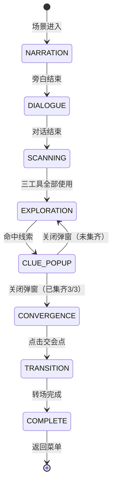

# 序章 · 残页 —— 探索寻线玩法设计文档

> **文档性质**: 玩法设计详案（非代码文档）
> **版本**: v2.0
> **最后更新**: 2026-06-05

---

## 一、设计总纲

### 1.1 核心体验目标

玩家扮演古画修复研究生沈念，在高精度扫描仪前独立完成对《拙政园三十一景图》第三十一景的首次检查。序章的玩法目标是让玩家亲手体验**"从表面完整中发现隐藏痕迹"**的过程——这同时也是整部游戏核心悬念的隐喻。

### 1.2 设计原则

| 原则 | 说明 |
|------|------|
| **主动发现** | 线索不主动暴露自己，玩家必须动手寻找，而非被动接收 |
| **渐进引导** | 不设硬失败，错误操作只会触发越来越明确的引导提示 |
| **叙事融入** | 所有 UI 反馈均以叙事语言呈现，不出现游戏机制术语 |
| **节奏可控** | 玩家可以选择在每条线索上花更多时间（询问周老师、记笔记），也可以快速推进 |

### 1.3 序章完整节拍表

```
┌───────────────────────────────────────────────────────────┐
│  序章 · 残页                                               │
│                                                           │
│  ① 场景旁白（3段） ─→ ② 导师出场旁白                        │
│  ─→ ③ 周鹤年对话（5段气泡）                                 │
│  ─→ ④ 工具扫描阶段（三工具逐一使用）                         │
│  ─→ ⑤ 自由探索阶段（放大镜缩放 + 点击寻线）                  │
│  ─→ ⑥ 线索弹窗（发现线索 + 询问/记录）× 3                   │
│  ─→ ⑦ 汇聚确认（交会点出现 + 玩家主动点击）                  │
│  ─→ ⑧ 跌入画中转场（褪色→墨迹→文字→回声→淡出）              │
│  ─→ ⑨ 返回菜单 · 解锁第一章                                │
│                                                           │
└───────────────────────────────────────────────────────────┘
```

---

## 二、阶段详设

### 阶段 ④：工具扫描

> **入口条件**：周鹤年 5 段对话结束
> **退出条件**：三种工具各使用至少一次

#### 画面布局

```
┌─────────────────────────────────────────────┐
│  ← 返回                           📦 物品栏 │  ← 顶部工具栏
│                                             │
│                                             │
│            第三十一景 · 全屏展示              │  ← 古画占据全部画面
│          （带工具特效叠加层）                  │     无参考面板
│                                             │
│                                             │
│                                             │
├─────────────────────────────────────────────┤
│    🔍 放大镜    🔬 纸质分析    💡 侧光照射    │  ← 工具栏
├─────────────────────────────────────────────┤
│  ● 高精度扫描仪 · 在线        已使用: 0 / 3  │  ← 状态栏
└─────────────────────────────────────────────┘
```

> [!NOTE]
> **与旧方案的关键差异**：去除了右侧"参考页"面板。古画始终全屏展示，沉浸感更强。

#### 交互逻辑

| 操作 | 响应 |
|------|------|
| 点击工具按钮 | 切换到该工具的视觉特效覆盖层（滤镜 + 叠加元素） |
| 再次点击同一工具 | 取消激活，恢复原画 |
| 首次使用某工具 | 底部旁白面板浮现反馈文本（3 秒后自动消失），工具按钮标记 ✓ |
| 三工具全部使用 | 触发过渡：旁白 → 进入阶段 ⑤ |

#### 三工具反馈文本

| 工具 | 视觉效果 | 反馈旁白 |
|------|---------|---------|
| 🔍 放大镜 | 画面放大 1.4×，聚焦右上边缘区域 | "装裱接缝处有重叠痕迹，边框似乎压住了旧题签的一角。" |
| 🔬 纸质分析 | 画面降饱和度，纤维纹理叠加 | "背纸与其他三十页不完全一致，显示此页曾经重装；画心本身较稳定，并非整幅新画。" |
| 💡 侧光照射 | 斜向光影扫过画面 | "装裱边缘开始透出底层的东西——有旧字残痕，还有一条极细的线。" |

#### 三工具全部使用后的过渡

1. 所有工具特效关闭，画面恢复原状
2. 旁白面板浮现（需点击推进）：

> "三种检测都指向同一件事：这幅画的表面没有问题，但装裱层下藏着不该被遮住的东西。"

3. 点击后旁白切换为：

> "你决定更仔细地检查这幅画。放大扫描件，逐寸寻找那些被遮盖的痕迹。"

4. 旁白消失 → 画面过渡到阶段 ⑤

---

### 阶段 ⑤：自由探索

> **入口条件**：阶段 ④ 过渡完成
> **退出条件**：找到全部 3 处线索

#### 画面布局

```
┌─────────────────────────────────────────────┐
│  ← 返回                           📦 物品栏 │
│                                             │
│                                             │
│                                             │
│        第三十一景 · 可缩放 / 可拖拽           │  ← 鼠标变为放大镜图标
│       （无工具特效，原画高清展示）             │
│                                             │
│                                             │
│                                             │
├─────────────────────────────────────────────┤
│  🔍 线索: 0 / 3           滚轮缩放 · 拖拽移动 │  ← 探索状态栏
└─────────────────────────────────────────────┘
                                      
        ┌──────────────────────────┐
        │ 💬 问周老师              📓 │  ← 右下角悬浮按钮（保持可用）
        └──────────────────────────┘
```

#### 缩放与平移

| 操作 | 行为 | 参数 |
|------|------|------|
| **鼠标滚轮上滑** | 以鼠标位置为中心放大画面 | 每次 +0.25×，最大 3.5× |
| **鼠标滚轮下滑** | 以鼠标位置为中心缩小画面 | 每次 -0.25×，最小 1.0× |
| **鼠标左键按住拖拽** | 平移画面（仅缩放 > 1.0× 时有效） | 实时跟随，松开惯性滑动 |
| **双击画面** | 若当前 1.0× → 快速放大到 2.0×；若已放大 → 还原到 1.0× | 带 0.3s 缓动动画 |

**边界约束**：
- 画面任何一边不得拖出可视区域（始终有画面内容填满窗口）
- 缩放时如果画面边缘超出，自动回弹校正

**鼠标光标**：
- 默认状态：`🔍` 放大镜图标（CSS `cursor: zoom-in`）
- 拖拽中：`✋` 抓手图标（CSS `cursor: grabbing`）
- 悬停在已发现线索标记上：`👆` 指针（CSS `cursor: pointer`）

#### 点击探寻

玩家在画面上**单击**试图寻找线索。系统判定点击位置是否落在某个线索的判定区内。

**判定机制**：
- 每个线索有一个**圆形判定区**，定义为 `{ cx, cy, radius }`（百分比坐标，相对于原画尺寸）
- 玩家点击时，将屏幕坐标反算为原画百分比坐标（考虑当前缩放和平移偏移）
- 若距离某个未发现线索的中心 ≤ `radius`，则判定为"命中"
- 若未命中任何线索，则 `wrongClickCount++`

**命中反馈**：
- 画面在命中位置播放一个短暂的**金色涟漪扩散**动画（0.5s）
- 同时画面自动缓缓缩放到该区域（如果玩家当前缩放比例较小）
- 0.5s 后弹出线索窗口（阶段 ⑥）

**未命中反馈**：
- 点击位置出现一个极淡的**灰色涟漪**（0.3s 消失），表示"这里没有发现"
- 不弹出任何文字，保持沉浸感
- 后台 `wrongClickCount` 静默累加

#### 已发现线索的标记

当某处线索被发现并关闭弹窗后，该位置留下一个**常驻视觉标记**：
- 微弱的金色圆形光点（半径约 20px）
- 低频慢呼吸动画（`opacity: 0.4 ↔ 0.7`，周期 3s）
- 悬停时显示线索名称 tooltip（如"装裱接缝残角"）
- 点击可重新查看线索内容（但按钮变为"已记录 ✓"）

#### 探索状态栏

底部状态栏替换扫描阶段的工具栏：

```
┌──────────────────────────────────────────┐
│  🔍 线索: ●○○  (1/3)      滚轮缩放 · 拖拽移动  │
└──────────────────────────────────────────┘
```

- `●` = 已发现（金色实心圆）
- `○` = 未发现（灰色空心圆）
- 右侧操作提示在玩家首次缩放后自动淡出

---

### 阶段 ⑤-b：渐进提示（错误引导）

> **触发条件**：`wrongClickCount` 达到阈值
> **设计理念**：从抽象方法论 → 具体方向 → 直接视觉提示，三级递进

#### 提示级别

| 级别 | 触发条件 | 提示形式 | 提示内容 |
|------|---------|---------|---------|
| **Lv.1** | 错误点击 ≥ 3 次 | 底部浮现旁白条（周鹤年口吻） | "不要先看画面本身。先看它的身体——边缘、接缝、装裱层。" |
| **Lv.2** | 错误点击 ≥ 6 次 | 底部旁白条更新 | "表层画面很完整，真正不完整的是说明来源的那些部分。试试画面的角落和边缘。" |
| **Lv.3** | 错误点击 ≥ 9 次 | **视觉直接提示** | 所有未发现的线索位置出现微弱的**白色光斑闪烁**（周期 2s，opacity 0.15→0.35），不再用文字提示 |

#### 提示条 UI 规格

```
┌──────────────────────────────────────────────────────────┐
│  💡 周鹤年的声音在耳边响起：                                │
│  "不要先看画面本身。先看它的身体——边缘、接缝、装裱层。"       │
└──────────────────────────────────────────────────────────┘
```

- 位置：画面底部，居中浮动（不遮挡探索状态栏）
- 样式：与旁白面板统一的暗木匾额风格
- 行为：显示 5 秒后自动淡出；不阻塞探索操作（玩家可继续点击）
- 同一级别的提示只显示一次，不重复

#### Lv.3 视觉提示细节

- 未发现的线索位置出现圆形光斑（半径约 40px）
- 颜色：`rgba(255, 255, 255, 0.2)` → `rgba(255, 255, 255, 0.4)` 呼吸循环
- 光斑不可点击（不是按钮），仅作为视觉暗示
- 玩家仍需点击光斑范围内才算命中

---

### 阶段 ⑥：线索弹窗

> **入口条件**：玩家点击命中某处线索
> **退出条件**：玩家选择"存入记事簿"或"询问周老师"后关闭弹窗

#### 弹窗结构

```
┌─────────────────────────────────────────────┐
│                                             │
│  ┌─────────────────────────────────────┐    │
│  │  ● 发现线索                         │    │  ← 暗木色匾额风格
│  │  ─────────────────────────────────  │    │
│  │                                     │    │
│  │  装裱接缝残角                        │    │  ← 线索标题（金色）
│  │                                     │    │
│  │  装裱边缘压住了一小片旧题签的残角。    │    │  ← 线索描述（打字机效果）
│  │  题签纸质与画心不同，边缘有被刀裁切    │    │
│  │  过的痕迹——有人在重新装裱时，把原来    │    │
│  │  的题签裁掉了大部分，只留下了被新边    │    │
│  │  覆盖的这一角。                      │    │
│  │                                     │    │
│  │  ─────────────────────────────────  │    │
│  │  [ 📓 存入记事簿 ]  [ 💬 询问周老师 ] │    │  ← 两个操作按钮
│  │                                     │    │
│  └─────────────────────────────────────┘    │
│                                             │
└─────────────────────────────────────────────┘  ← 半透明遮罩层
```

#### 弹窗行为

| 步骤 | 行为 |
|------|------|
| 弹出时 | 画面冻结缩放/拖拽；半透明遮罩覆盖；弹窗从中心缩放弹出（0.3s） |
| 线索描述 | 打字机效果逐字显示（45ms/字）；点击可跳过直接显示全文 |
| 全文显示后 | 底部两个按钮淡入可用 |
| 点击"存入记事簿" | 线索记录到笔记本 → 按钮变为"✓ 已记录"（不可再点）→ 弹窗可关闭 |
| 点击"询问周老师" | 弹窗暂时隐藏（不关闭）→ 打开周鹤年对话面板，预填消息为线索摘要自动发送 → 对话结束后弹窗恢复显示 |
| 关闭弹窗 | 弹窗缩放收起 → 遮罩淡出 → 画面恢复可操作 → 线索位置留下金色标记 |

> [!NOTE]
> 两个按钮**不互斥**——玩家可以先存入记事簿，再询问周老师，或反之。但至少要执行一项操作后弹窗才能关闭（确保线索不会丢失）。

#### 三处线索详设

**线索 1：装裱接缝残角**

| 属性 | 值 |
|------|------|
| 判定区中心 | 画面右上 `(85%, 12%)` |
| 判定半径 | 8%（原画尺寸百分比） |
| 叙事定位 | 指向"有人刻意裁去了旧题签" → 证据：来源说明被物理移除 |
| 弹窗标题 | 装裱接缝残角 |
| 弹窗内容 | "装裱边缘压住了一小片旧题签的残角。题签纸质与画心不同，边缘有被刀裁切过的痕迹——有人在重新装裱时，把原来的题签裁掉了大部分，只留下了被新边覆盖的这一角。" |
| 周鹤年预填消息 | "我在装裱接缝处发现了一小片被裁掉的旧题签残角，这说明什么？" |
| 存入记事簿文案 | `[线索] 装裱接缝残角 — 旧题签被刻意裁去，只留被覆盖的一角` |

**线索 2："……所见"残字**

| 属性 | 值 |
|------|------|
| 判定区中心 | 画面左下 `(14%, 80%)` |
| 判定半径 | 8% |
| 叙事定位 | 指向"有人曾在此标注视角来源" → 核心证据 |
| 弹窗标题 | "……所见"残字 |
| 弹窗内容 | "侧光下，装裱边的下方隐约浮现两个残字：'……所见'。笔迹纤细，不像是文徵明的书风。倒更像是某种旁注——有人曾在这里标注过什么，后来被装裱层压在了下面。" |
| 周鹤年预填消息 | "装裱层下有两个残字'所见'，笔迹不像文徵明，这是谁写的？" |
| 存入记事簿文案 | `[线索] "……所见"残字 — 装裱层下的陌生笔迹旁注` |

**线索 3：底层细线**

| 属性 | 值 |
|------|------|
| 判定区中心 | 画面中下 `(50%, 75%)` |
| 判定半径 | 10%（较大，因为细线是横向的） |
| 叙事定位 | 指向"画面下方有不属于画面内容的痕迹" → 异常但含义未明 |
| 弹窗标题 | 底层细线 |
| 弹窗内容 | "一条极淡的线横贯画面下方，比裂纹规整，但不是画面内容的一部分，也不像装裱时留下的。它在那里很久了，但没有人在正式记录中提到过它。" |
| 周鹤年预填消息 | "画面下方有一条极淡的线，不像裂纹也不像装裱的一部分，这可能是什么？" |
| 存入记事簿文案 | `[线索] 底层细线 — 画面下方有一条不属于画面内容的极淡细线` |

---

### 阶段 ⑦：汇聚确认

> **入口条件**：3 处线索全部发现并关闭弹窗
> **退出条件**：玩家点击交会点

#### 流程

```
3/3 线索收集完成
    │
    ▼
画面自动缓缓还原到 1.0× 缩放（0.8s 缓动）
    │
    ▼
旁白面板浮现（需点击推进）：
"三处痕迹都藏在装裱层下面。不是破损，不是修补——
 倒像是有什么东西被刻意压在了下面。"
     │
     ▼
点击推进 → 旁白切换：
"残字、细线、被裁去的题签……
 它们的交会处，就在这里。"
    │
    ▼
画面上，三处已发现的金色标记同时发出一道细线，
三线汇聚到画面中央偏下方的一个点——交会点
    │
    ▼
交会点出现：金色光圈 + 脉冲动画
（比探索阶段的标记更强烈、更明亮）
交会点下方浮现文字提示："点击查看"
    │
    ▼
玩家点击交会点
    │
    ▼
触发阶段 ⑧：跌入画中转场
```

#### 交会点视觉设计

```
        ╭─ 来自线索1的细线（右上→中下）
        │
   ●────●────● ← 交会点（金色脉冲光圈，60×60px）
   │         │
   │         ╰─ 来自线索3的细线（中下横线方向）
   │
   ╰─ 来自线索2的细线（左下→中下）
```

- 三条连接线：`1px` 金色半透明线，从各标记点向交会点连线
- 连接线动画：从各标记点向交会点**依次生长**（各 0.6s，间隔 0.3s）
- 交会点：出现时从 `scale(0)` 弹到 `scale(1)` + 金色脉冲呼吸
- 交会点下方文字"点击查看"：淡入显示，小字号，金色

#### 触发跌入

玩家点击交会点后：

1. 交会点爆发一圈金色涟漪
2. 短暂停顿（0.3s）
3. 记录状态变量 `foundMarginTrace = true`
4. 进入跌入画中转场（阶段 ⑧，沿用现有 `FallTransition`）

> 注：修复笔记本已在阶段③→④过渡时获得（周鹤年对话结束后），此处不再重复给予。

---

## 三、状态机总览



### 状态变量追踪

| 变量 | 类型 | 写入时机 | 用途 |
|------|------|---------|------|
| `scanToolsUsed` | int (0-3) | 每使用一个工具 +1 | 判断是否进入探索阶段 |
| `cluesFound` | string[] | 每发现一处线索时 push ID | 判断线索收集进度 |
| `wrongClickCount` | int | 每次未命中 +1 | 触发渐进提示 |
| `hasNotebook` | bool | 周鹤年对话结束后（阶段③→④过渡） | 解锁笔记本 UI |
| `foundMarginTrace` | bool | 点击交会点时 | 终章结局分支条件 |

> [!IMPORTANT]
> `cluesFound` 和 `wrongClickCount` 仅为运行时变量，不需要写入 `gameProgress` 存档（序章不支持中途存档恢复到探索阶段）。`hasNotebook`、`foundMarginTrace`、`scanToolsUsed` 需要持久化到 `gameProgress`。

---

## 四、边界情况与容错

| 场景 | 处理方式 |
|------|---------|
| 玩家在探索阶段按 Esc | 弹出确认："离开后当前探索进度不会保存，确定返回菜单？" |
| 玩家在线索弹窗打开时按 Esc | 关闭弹窗（前提：至少执行了一项操作）；若未执行任何操作则不响应 Esc |
| 玩家询问周老师后关闭对话面板 | 线索弹窗恢复显示，"询问周老师"按钮变为"✓ 已询问" |
| 玩家在探索阶段点击"问周老师"悬浮按钮 | 正常打开对话面板（不影响探索状态）；关闭后继续探索 |
| 玩家重复点击已发现的线索位置 | 重新打开线索弹窗（只读模式：按钮均为"已记录 ✓"状态） |
| AI 服务不可用时点击"询问周老师" | 按钮可点击，对话面板打开，发送消息后走降级流程（叙事化错误文本） |
| 窗口大小变化 / 全屏切换 | 重新计算缩放和平移的约束边界，确保画面不溢出 |

---

## 五、叙事整合要点

### 与核心逻辑的一致性

> 核心逻辑：第三十一景的画面保留了王蘅发现的低位视角；文徵明以自己的笔保存了她的眼睛。后人并没有重画此景，而是在重装、配边、归档过程中遮蔽了说明这个视角来源的边注、题签、辅助线和残字。

三处线索的设计严格对应核心逻辑中的"被遮蔽的来源说明"：

```
装裱接缝残角  →  题签（来源标注载体）被裁去
"……所见"残字  →  旁注（来源文字记录）被压在装裱层下
低位构图辅助线 →  辅助线（来源视角证据）残留在画面中
```

玩家在序章亲手找到的不是"一幅画的破损"，而是"一段来源信息被系统性地移除的证据"。这为后续章节"找回被吸收掉的观看来源"埋下了悬念基础。

### 周鹤年 AI 对话的叙事约束

当玩家通过线索弹窗的"询问周老师"发送预填消息时，周鹤年 AI 的回复应当：

- ✅ 从修复学角度解释技术细节（纸张分析、装裱工艺等）
- ✅ 引导玩家思考"为什么这些痕迹被遮盖了"
- ❌ 不直接揭示王蘅的存在
- ❌ 不直接说出"视角来源"的答案
- ❌ 不改变三基准中的任何设定

---

## 六、文件变更清单

| 操作 | 文件 | 说明 |
|------|------|------|
| **新建** | `src/components/clue-explorer.js` | 缩放/拖拽/点击判定/渐进提示/标记管理 |
| **新建** | `src/components/clue-popup.js` | 线索发现弹窗（打字机、双按钮、遮罩） |
| **修改** | `src/components/scanner-ui.js` | 移除交会热点和参考面板；新增 `onAllToolsUsed` 回调 |
| **修改** | `src/pages/prologue.js` | 新增 `EXPLORATION` / `CONVERGENCE` 阶段；接入新组件 |
| **修改** | `src/components/chat-panel.js` | 新增 `openWithMessage(text)` 方法 |
| **修改** | `src/components/notebook-panel.js` | 监听 `clue-collected` 事件 |
| **修改** | `src/styles/index.css` | 新增探索模式、线索弹窗、汇聚连线等样式 |
