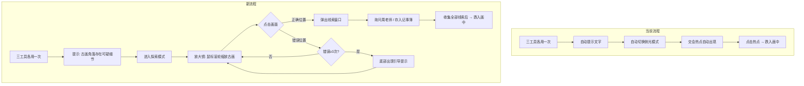

# 序章 · 探索寻线玩法重构

## 目标

将序章扫描阶段从当前的"自动出现热点→点击→跌入"改为**主动探索式寻线玩法**：玩家使用放大镜在古画上自由缩放、点击探寻，找到隐藏线索后弹出线索窗口，并可选择"询问周老师"或"存入记事簿"。

## 当前流程 vs 新流程



## 线索设计（3 处可发现区域）

基于剧情设定，古画上有 **3 处隐藏线索**，玩家需要逐一找到：

| # | 线索名称 | 画面位置 | 发现后弹窗内容 |
|---|---------|---------|---------------|
| 1 | **装裱接缝残角** | 画面右上角边缘（约 `85%, 12%`） | "装裱边缘压住了一小片旧题签的残角。题签纸质与画心不同，边缘有被刀裁切过的痕迹——有人在重新装裱时，把原来的题签裁掉了大部分，只留下了被新边覆盖的这一角。" |
| 2 | **"……所见"残字** | 画面左下角（约 `12%, 82%`） | "侧光下，装裱边的下方隐约浮现两个残字：'……所见'。笔迹纤细，不像是文徵明的书风。倒更像是某种旁注——有人曾在这里标注过什么，后来被装裱层压在了下面。" |
| 3 | **低位构图辅助线** | 画面中下方（约 `45%, 75%`） | "一条极淡的墨线横贯画面下方，不是画面内容的一部分。这是一条构图辅助线——画家在正式落笔前用来确定视角高度的参考。它的位置异常低，说明作画者的视线几乎与地面平齐。这不是站着画的。" |

> [!IMPORTANT]
> 每处线索的点击判定区域为以坐标为中心的 **80×80px 矩形**（会随缩放等比变化）。玩家点击落在判定区内即视为"找到"。

## 渐进提示设计（错误点击 ≥ 3 次后触发）

| 错误次数 | 提示内容 |
|---------|---------|
| 3 次 | "不要先看画面本身。先看它的身体——边缘、接缝、装裱层。" |
| 6 次 | "表面画面很完整，真正不完整的是说明它来源的那些部分。试试画面的角落和边缘。" |
| 9 次 | 未找到的线索位置上出现**微弱的光点闪烁**（视觉直接提示） |

## Open Questions

> [!IMPORTANT]
> **Q1: 线索收集顺序**
> 三处线索是否需要按固定顺序发现（1→2→3），还是可以任意顺序？
> 建议：**任意顺序**，更符合自由探索的体验。

> [!IMPORTANT]
> **Q2: 跌入触发条件**
> 找到全部 3 处线索后自动触发跌入，还是需要玩家再做一个确认操作（比如点击交会处）？
> 建议：找到第 3 处线索后，弹窗关闭时自动播放一段旁白过渡（"三处痕迹指向同一个方向……"），然后触发跌入转场。

> [!IMPORTANT]
> **Q3: 探索阶段的画面显示**
> 进入探索模式后，是否保留左右分屏？
> 建议：**去掉右侧参考面板**，让古画占据全屏（沉浸感更强），工具栏收缩到底部小条。

---

## Proposed Changes

### 新增组件

#### [NEW] [clue-explorer.js](file:///E:/AI_%E6%96%87%E6%B8%B8_%E5%8D%85%E4%B8%80%E6%99%AF/-/Web/src/components/clue-explorer.js)

替代当前 `scanner-ui.js` 后半段的"交会热点"逻辑。核心功能：

```
ClueExplorer
├── 画面容器（支持鼠标滚轮缩放 + 拖拽平移）
│   ├── 古画图片（transform: scale + translate）
│   └── 3 个隐藏判定区域（不可见，仅用于碰撞检测）
├── 点击处理
│   ├── 命中判定区 → 弹出线索窗口
│   └── 未命中 → wrongClickCount++ → 检查是否触发提示
├── 底部提示栏（错误 ≥ 3 次后出现）
└── 线索弹窗
    ├── 线索标题 + 描述文本
    ├── [询问周老师] 按钮 → 打开 ChatPanel 并预填线索
    └── [存入记事簿] 按钮 → 调用 NotebookPanel 添加批注
```

**关键实现细节**：

- **缩放**：`wheel` 事件控制 `scale`（范围 `1.0 ~ 3.5`），以鼠标位置为缩放中心
- **平移**：缩放后可拖拽画面（`mousedown` → `mousemove` → `mouseup`）
- **判定区**：3 个 `{ x, y, radius }` 定义的圆形区域，碰撞检测时需将点击坐标反算到原始画面坐标系
- **线索弹窗**：居中浮层，深色匾额风格（与现有对话框统一）

---

#### [NEW] [clue-popup.js](file:///E:/AI_%E6%96%87%E6%B8%B8_%E5%8D%85%E4%B8%80%E6%99%AF/-/Web/src/components/clue-popup.js)

线索发现弹窗组件：

```
┌─────────────────────────────────────┐
│  ● 发现线索                         │
│─────────────────────────────────────│
│                                     │
│  装裱接缝残角                        │
│                                     │
│  装裱边缘压住了一小片旧题签的残角……    │
│                                     │
│─────────────────────────────────────│
│  [ 📓 存入记事簿 ]  [ 💬 询问周老师 ] │
└─────────────────────────────────────┘
```

- 匾额/木板风格（延续现有暗木色系）
- 标题区：线索名称（金色大字）
- 内容区：线索描述（宣纸色文字，打字机逐字显示）
- 按钮区：两个操作按钮
  - **存入记事簿**：调用 `engine.emit('clue-collected', clueData)` → 笔记本面板自动新增批注 → 按钮变为"✓ 已记录"
  - **询问周老师**：打开 `ChatPanel` 并将线索摘要作为预填消息自动发送给周鹤年 AI

---

### 修改文件

#### [MODIFY] [scanner-ui.js](file:///E:/AI_%E6%96%87%E6%B8%B8_%E5%8D%85%E4%B8%80%E6%99%AF/-/Web/src/components/scanner-ui.js)

- 移除交会热点（`scanner-intersection`）相关代码
- 三工具全部使用后，不再自动切到侧光模式
- 新增 `enterExplorationMode()` 方法：隐藏右侧参考面板，让左侧画面全屏展开
- 添加 `onAllToolsUsed` 回调接口，通知 `prologue.js` 进入探索阶段

#### [MODIFY] [prologue.js](file:///E:/AI_%E6%96%87%E6%B8%B8_%E5%8D%85%E4%B8%80%E6%99%AF/-/Web/src/pages/prologue.js)

- 新增 `PHASE.EXPLORATION` 阶段（插入在 `SCANNER` 和 `TRANSITION` 之间）
- `_onToolUsed` 中：三工具全部使用后 → 显示提示旁白 → 实例化 `ClueExplorer`
- 新增 `_onClueFound(clue)` 回调：弹出 `CluePopup`
- 新增 `_onAllCluesFound()` 回调：播放过渡旁白 → 触发跌入转场
- 追踪状态变量：`foundMarginTrace`、`hasNotebook`、`scanToolsUsed`

#### [MODIFY] [index.css](file:///E:/AI_%E6%96%87%E6%B8%B8_%E5%8D%85%E4%B8%80%E6%99%AF/-/Web/src/styles/index.css)

新增样式：
- `.clue-explorer` — 全屏画面容器，`overflow: hidden`，`cursor: zoom-in`
- `.clue-explorer--dragging` — 拖拽时 `cursor: grabbing`
- `.clue-hint-bar` — 底部提示条（错误点击后浮现）
- `.clue-popup-overlay` — 弹窗遮罩
- `.clue-popup` — 匾额风格弹窗（延续 `.dialogue-bubble` 的暗木色系）
- `.clue-popup-actions` — 底部按钮区
- `.clue-marker` — 已发现线索的标记点（微弱的金色光点）
- `.clue-progress` — 线索收集进度指示器（`1/3`、`2/3`、`3/3`）

#### [MODIFY] [chat-panel.js](file:///E:/AI_%E6%96%87%E6%B8%B8_%E5%8D%85%E4%B8%80%E6%99%AF/-/Web/src/components/chat-panel.js)

- 新增 `openWithMessage(text)` 公开方法：打开面板并自动发送预填消息
- 线索弹窗的"询问周老师"按钮调用此方法，将线索文本发送给 AI

#### [MODIFY] [notebook-panel.js](file:///E:/AI_%E6%96%87%E6%B8%B8_%E5%8D%85%E4%B8%80%E6%99%AF/-/Web/src/components/notebook-panel.js)

- 监听新事件 `clue-collected`：自动生成一条线索类型的批注
- 新增线索批注的专用样式（区别于普通事件批注）

---

## Verification Plan

### Manual Verification

1. **缩放测试**：滚轮上滑放大、下滑缩小，确认缩放以鼠标位置为中心，边界不超出
2. **拖拽测试**：放大后按住拖拽平移，松开停止，确认不能拖出画面边界
3. **正确点击**：点击 3 处线索位置，确认弹窗正确弹出、内容对应
4. **错误点击**：故意点错 3 次，确认底部提示出现；点错 6 次，确认提示升级；点错 9 次，确认光点出现
5. **"询问周老师"**：点击后确认 ChatPanel 打开并自动发送线索文本
6. **"存入记事簿"**：点击后确认笔记本新增批注，按钮变灰
7. **全部收集**：3 处线索全部找到后，确认过渡旁白播放 → 跌入转场触发
8. **状态持久化**：跌入后检查 `gameProgress` 中 `foundMarginTrace`、`hasNotebook`、`scanToolsUsed` 是否正确写入
